# Keycloak tutorial

In this tutorial, we will set up Keycloak as an IAM server and Wildfly as an application server.
We will then deploy a quickstart application to the Wildfly application server and change its authentication to be handled by Keycloak.

## Prerequisites
Below is a list of software components needed for this tutorial. The tutorial does not fully detail how to install and use all of them, but will detail most of the configuration needed for this tutorial. In brackets, I list the specific versions used. 

### Mandatory
* Java SDK (Adopt Open-JDK 12)
* Maven 3.1.1 or higher (Maven 3.6.1)

#### Downloads described below 
* Wildfly (17.0.1-Final)
* Keycloak
  * Server (6.0.1)
  * Client Adapter for Wildfly (6.0.1)
* Keycloack quickstarts demo-app (tag 6.0.1)

### Optional
* GIT
* VM software (VirtualBox 6.0)
* Running Linux VM (Ubuntu 18.04 server)

## VM install
**All commands are run on the VM, unless otherwise stated.**

We can use Ubuntu server on VirtualBox to install both Wildfly and Keycloak. Setting up network so we can login using SSH is a bit challenging.

By default VirtualBox uses NAT for supplying network to the VM. That way, the VM itself has no separate IP. If we want to SSH to the VM, we have these options:
* setup port forwarding using [this guide](https://www.howtogeek.com/122641/how-to-forward-ports-to-a-virtual-machine-and-use-it-as-a-server/)
  * This shields the VM by only allowing connections from the host
  * We need to setup port forwarding for each port you use
* select bridged networking
  * No port forwarding necessary
  * VM has its own IP, which is more like real-life scenario

For this tutorial we'll use bridged networking, since there are several ports that we need to use. In real world scenario's, we should shield the admin consoles of both servers using Firewall / network rules.

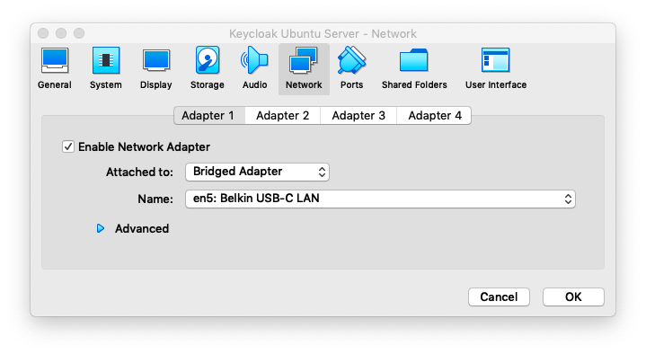

Once started we can login, change the user's password using ```passwd``` and review the IP it is assigned, so we can connect with ssh. We should also update the VM's Ubuntu version.
```bash
bram@ubuntu_server:~$ sudo apt-get upgrade
Reading package lists... Done
Building dependency tree
Reading state information... Done
Calculating upgrade... Done
[...]
Processing triggers for initramfs-tools (0.130ubuntu3.8) ...
update-initramfs: Generating /boot/initrd.img-4.15.0-55-generic
bram@ubuntu_server:~$
```

## Download
See notes below these links.

* [Wildfly](https://wildfly.org/downloads/)
* [Keycloak](https://www.keycloak.org/downloads.html)
  * Server
  * Client Adapter for Wildfly
* [Keycloack quickstarts](https://github.com/keycloak/keycloak-quickstarts) from Github (see below)

On the Ubuntu server, we should download the Wildfly and Keycloak components. We can use ```wget``` for this:
```bash
mkdir downloads
cd downloads
wget https://downloads.jboss.org/keycloak/6.0.1/keycloak-6.0.1.tar.gz
wget https://downloads.jboss.org/keycloak/6.0.1/keycloak-6.0.1.tar.gz.sha1
wget https://downloads.jboss.org/keycloak/6.0.1/adapters/keycloak-oidc/keycloak-wildfly-adapter-dist-6.0.1.tar.gz
wget https://downloads.jboss.org/keycloak/6.0.1/adapters/keycloak-oidc/keycloak-wildfly-adapter-dist-6.0.1.tar.gz.sha1
wget https://download.jboss.org/wildfly/17.0.1.Final/wildfly-17.0.1.Final.tar.gz
wget https://download.jboss.org/wildfly/17.0.1.Final/wildfly-17.0.1.Final.tar.gz.sha1
```

### Check downloads

We should validate the Keycloak and Wildfly downloads with the supplied SHA1 hashes. The SHA1 files contain only the hashes and not the filename for its hashed file. We can check the hash in two ways:

#### Manual check
```bash
shasum -a 1 keycloak-6.0.1.tar.gz
cat keycloak-6.0.1.tar.gz.sha1
```

#### Automated check
* We copy the filename for each file and write it on the same line as the hash (using vi or similar)

```bash
vi keycloak-6.0.1.tar.gz.sha1
```
* Go to the end of line.
* Enter ```i```, you will see VI enter insert mode
* Move the cursor one more space to the right, so it's after the final character
* Enter two spaces
* Paste the filename

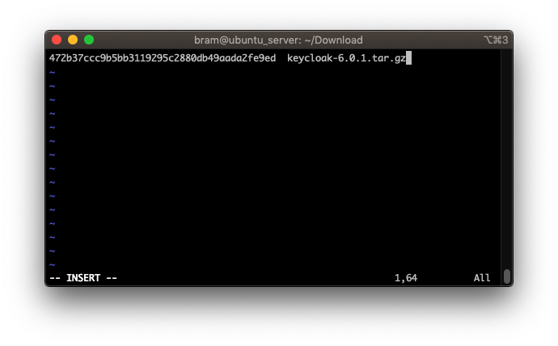

* Press escape to exit insert mode
* Enter ```:wq``` to save and exit VI (see, that wasn't so hard)
* Then run:
```bash
$ shasum -c -a 1 keycloak-6.0.1.tar.gz.sha1
keycloak-6.0.1.tar.gz: OK
```
* Repeat for each file

## Unzip
We can use the following commands to unzip the downloads:
```bash
tar -xvzf wildfly-17.0.1.Final.tar.gz
mv wildfly-17.0.1.Final ../
```


## Install Java
Next, we should install Java. Using the following commands to install Adopt OpenJDK.
```bash
wget -qO - https://adoptopenjdk.jfrog.io/adoptopenjdk/api/gpg/key/public | sudo apt-key add -
sudo add-apt-repository --yes https://adoptopenjdk.jfrog.io/adoptopenjdk/deb/
sudo apt-get update
sudo apt-get install adoptopenjdk-12-hotspot
```

## Setup and start Wildfly
From the Wildfly directory:
```bash
$ cd ../wildfly-17.0.1.Final/
```

By default, Wildfly binds only to the localhost. So it is only accessible from the localhost. Since we install it on a server VM without a browser, we will not be able to access it. We can configure Wildfly to be accessible from other servers using:
* Start with this option ```./standalone.sh -b=0.0.0.0```
* Change the configuration in ```standalone/configuration/standalone.xml``` from ```127.0.0.1``` to ```0.0.0.0``` (again, with VI or similar).
  * The following block is located at the end of the file:
```xml
    <interfaces>
        <interface name="management">
            <inet-address value="${jboss.bind.address.management:0.0.0.0}"/>
        </interface>
        <interface name="public">
            <inet-address value="${jboss.bind.address:0.0.0.0}"/>
        </interface>
    </interfaces>
```
In real world scenario's we would limit the management configuration to allow access only from selected internal machines.

Next, we will add a management user:
```bash
./bin/add-user.sh
What type of user do you wish to add?
 a) Management User (mgmt-users.properties)
 b) Application User (application-users.properties)
(a):
```
Choose A. The prompt will ask for a user-name. Note that the user ```admin``` is configured in the listed file, but is disabled.

```bash
Enter the details of the new user to add.
Using realm 'ManagementRealm' as discovered from the existing property files.
Username : admin
User 'admin' already exists and is enabled, would you like to...
 a) Update the existing user password and roles
 b) Disable the existing user
 c) Type a new username
(a):
```

Again choose A. Choose a strong password and save it in a password-management system. 
```bash
Password recommendations are listed below. To modify these restrictions edit the add-user.properties configuration file.
 - The password should be different from the username
 - The password should not be one of the following restricted values {root, admin, administrator}
 - The password should contain at least 8 characters, 1 alphabetic character(s), 1 digit(s), 1 non-alphanumeric symbol(s)
Password :
WFLYDM0102: Password should have at least 1 non-alphanumeric symbol.
Are you sure you want to use the password entered yes/no? yes
Re-enter Password :
```

Also give this user the role ```PowerUser```
```bash
What groups do you want this user to belong to? (Please enter a comma separated list, or leave blank for none)[  ]: PowerUser
Updated user 'admin' to file '/home/bram/wildfly-17.0.1.Final/standalone/configuration/mgmt-users.properties'
Updated user 'admin' to file '/home/bram/wildfly-17.0.1.Final/domain/configuration/mgmt-users.properties'
Updated user 'admin' with groups PowerUser to file '/home/bram/wildfly-17.0.1.Final/standalone/configuration/mgmt-groups.properties'
Updated user 'admin' with groups PowerUser to file '/home/bram/wildfly-17.0.1.Final/domain/configuration/mgmt-groups.properties'
```

Final prompt, enter ```no```
```bash
Is this new user going to be used for one AS process to connect to another AS process?
e.g. for a slave host controller connecting to the master or for a Remoting connection for server to server EJB calls.
yes/no? no
```

(Re)Start Wildfly with option ``` -b=0.0.0.0``` if you didn't change the configuration.

```bash
./bin/standalone.sh
```
 
On the host machine browse to the management console on the VM's IP: [http://192.168.1.78:9990/console/index.html](http://192.168.1.78:9990/console/index.html)
We should be able to login on the Wildfly management console using the admin user we just created. Note that the password is only stored in hashed format in the mgmt-users.properties file. Therefore, it cannot be retrieved from the server, but it can be reset by using the ```add-users.sh``` script.

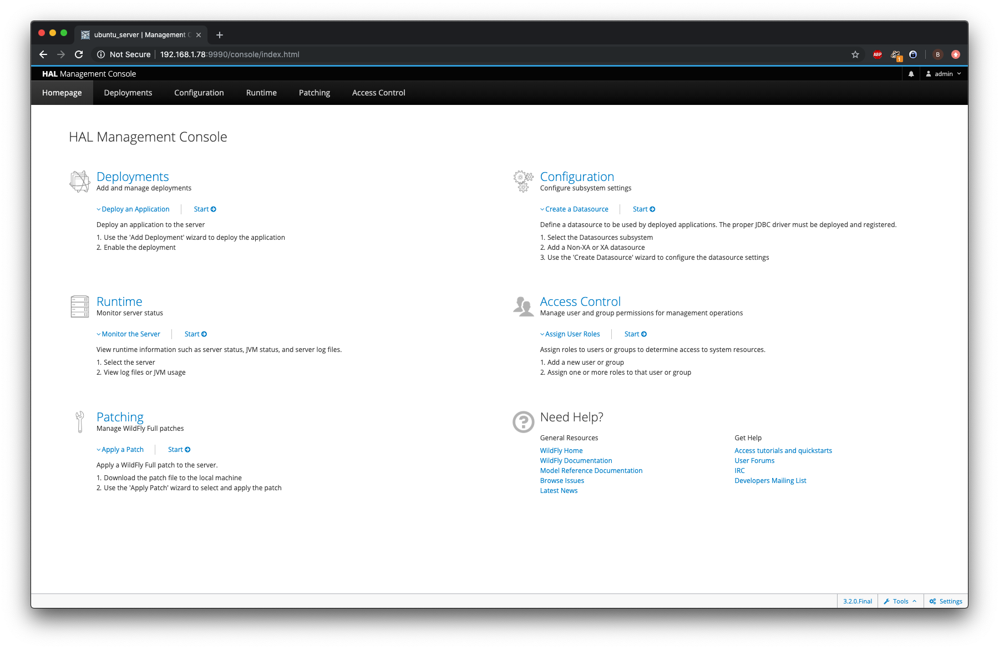

## Configure Demo

On the host machine, we will download the keycloack quickstarts project. Either clone the repo or download it as a zip:
```bash
git clone https://github.com/keycloak/keycloak-quickstarts
```

We will copy the following snippets to the ```pom.xml```
```
    <properties>
        <wildfly-home>/Users/shimul/wildfly-12.0.0.Final</wildfly-home>
        <wildfly-hostname>192.168.1.78</wildfly-hostname>
        <wildfly-port>9990</wildfly-port>
        <wildfly-username>admin</wildfly-username>
        <wildfly-password>Wildfly password</wildfly-password>
    </properties>
```

- [ ] TODO: Figure out how to securely save the Wildfly password in this configuration


Then we will deploy it to Wildfly. This will also build the project.

```bash
$ cd keycloak-quickstarts/app-profile-jee-vanilla
$ mvn clean wildfly:deploy
[INFO] Scanning for projects...
[...]
INFO: JBoss Remoting version 5.0.5.Final
Aug 19, 2019 5:42:38 PM org.xnio.Xnio <clinit>
INFO: XNIO version 3.5.4.Final
Aug 19, 2019 5:42:38 PM org.xnio.nio.NioXnio <clinit>
INFO: XNIO NIO Implementation Version 3.5.4.Final
Aug 19, 2019 5:42:39 PM org.wildfly.security.Version <clinit>
INFO: ELY00001: WildFly Elytron version 1.1.7.Final
[INFO] ------------------------------------------------------------------------
[INFO] BUILD SUCCESS
[INFO] ------------------------------------------------------------------------
[INFO] Total time:  19.650 s
[INFO] Finished at: 2019-08-19T17:42:43+02:00
[INFO] ------------------------------------------------------------------------
```

Open a webbrowser to [http://192.168.1.78:8080/vanilla/](http://192.168.1.78:8080/vanilla/). This will display a basic login dialog.
Since there is no identoty provider configured, we are not able to login with any user-credentials.

## Install & Configure Keycloak

We will then leave Wildfly running and open an extra connection to the VM. Then we unzip both Keycloak and the Keycloak adapter:
```bash
tar -xvzf keycloak-6.0.1.tar.gz
mv keycloak-6.0.1 ../
tar -xvzf keycloak-wildfly-adapter-dist-6.0.1.tar.gz
```

Since the Wildfly server already contains the same directories that the Keycloak adapter supplies, we can't simply move the directories. Therefore we sync and remove them:
```bash
rsync -a bin/ ../wildfly-17.0.1.Final/bin
rsync -a docs/ ../wildfly-17.0.1.Final/docs
rsync -a modules/ ../wildfly-17.0.1.Final/modules
rm -rf docs/
rm -rf bin/
rm -rf modules/
```


Increase the post-numbers with one so ```8080``` becomes ```8081``` etc. so they don't conflict with the Wilfly App-server. Also, again open the server for outside connections. Both settings are located somewhere at the end of the file ```standalone/configuration/standalone.xml```.  
```xml
    <interfaces>
        <interface name="management">
            <inet-address value="${jboss.bind.address.management:0.0.0.0}"/>
        </interface>
        <interface name="public">
            <inet-address value="${jboss.bind.address:0.0.0.0}"/>
        </interface>
    </interfaces>
    <socket-binding-group name="standard-sockets" default-interface="public" port-offset="${jboss.socket.binding.port-offset:0}">
        <socket-binding name="management-http" interface="management" port="${jboss.management.http.port:9991}"/>
        <socket-binding name="management-https" interface="management" port="${jboss.management.https.port:9994}"/>
        <socket-binding name="ajp" port="${jboss.ajp.port:8010}"/>
        <socket-binding name="http" port="${jboss.http.port:8081}"/>
        <socket-binding name="https" port="${jboss.https.port:8444}"/>
        <socket-binding name="txn-recovery-environment" port="4712"/>
        <socket-binding name="txn-status-manager" port="4713"/>
        <outbound-socket-binding name="mail-smtp">
            <remote-destination host="localhost" port="25"/>
        </outbound-socket-binding>
    </socket-binding-group>
```

We then create an admin user using the following script:
```bash
~/keycloak-6.0.1$ ./bin/add-user-keycloak.sh -u admin
Press ctrl-d (Unix) or ctrl-z (Windows) to exit
Password:
Added 'admin' to '/home/bram/keycloak-6.0.1/standalone/configuration/keycloak-add-user.json', restart server to load user
```

Boot up the Keycloak server:
```bash
cd keycloak-6.0.1/
./bin/standalone.sh
```

On the host-machine we open [http://192.168.1.78:8081/auth/](http://192.168.1.78:8081/auth/) which will display the welcome screen.
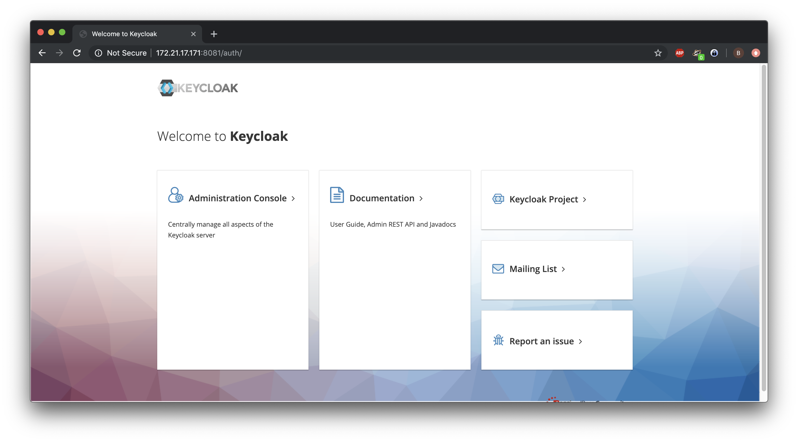

On the Administration Console we enter the admin credentials used to create the keycloak user.
This will take us to the admin dashboard.
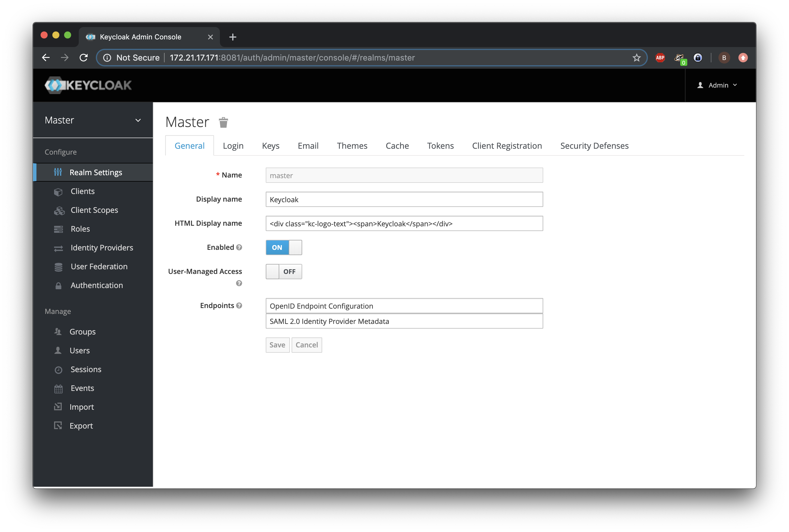
 
We will now create a new realm called ```demo```.
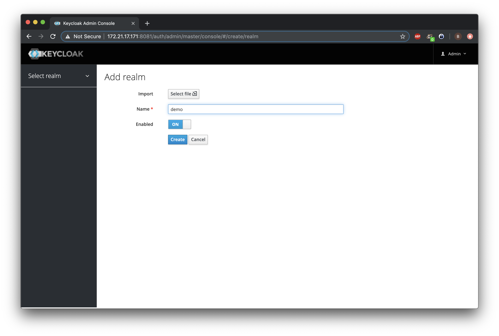

Within this realm, we create a user called demo and assign it a temporary password.
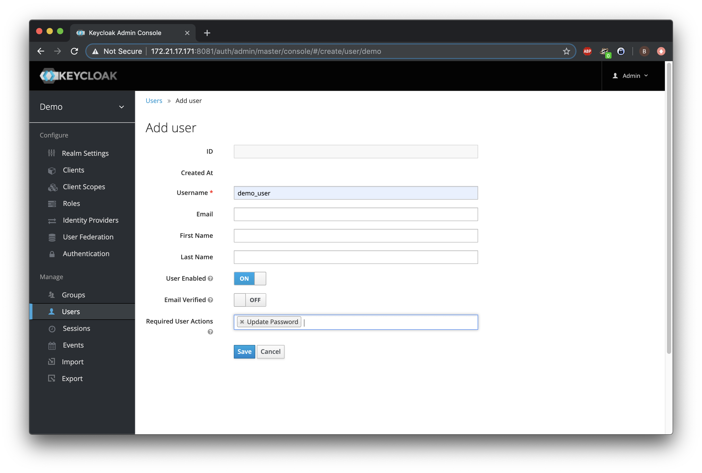

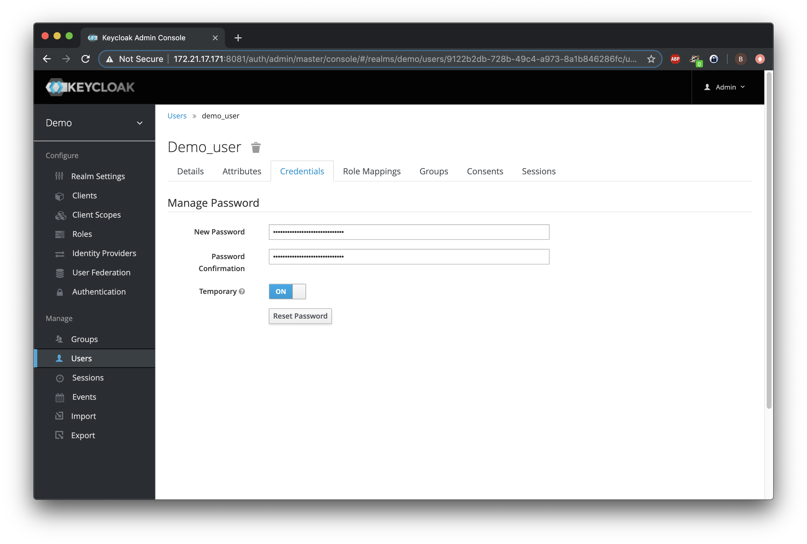

Next, we will install the Keycloak Adapter into the Wildfly App-server:
```bash
~/wildfly-17.0.1.Final$ cd bin/
~/wildfly-17.0.1.Final/bin$ ./jboss-cli.sh --file=adapter-install-offline.cli
{"outcome" => "success"}
{"outcome" => "success"}
{"outcome" => "success"}
{"outcome" => "success"}
~/wildfly-17.0.1.Final/bin$ ./standalone.sh
```

Next on the host in the Keycloak admin-dashboard, we browse to the clients for this realm and click Create:
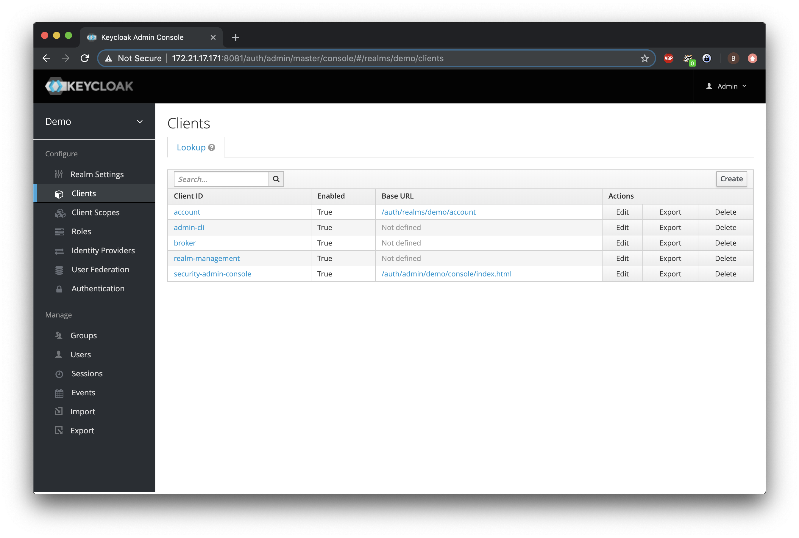

Fill in the URL of the application in Wildfly:
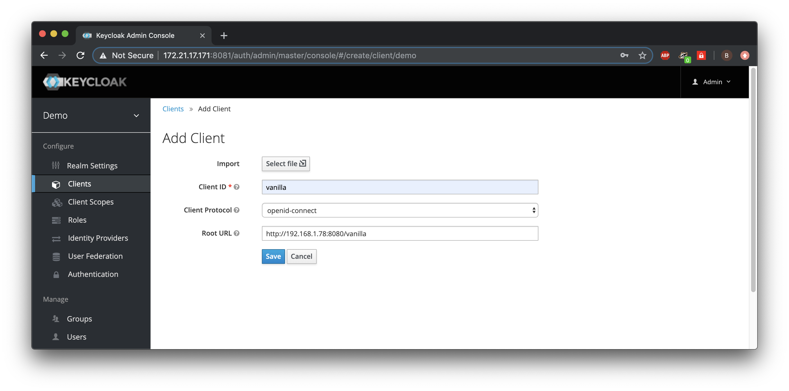

We will save these settings and then browse to the Installation tab. Here we can download the settings that will redirect the user from the Wildfly deployed application to Keycloak for providing an identity. We select Keycloak OIDC JSON and copy the JSON config. 


Next on the VM in Wildfly, we paste this configuration to the configuration file ```standalone/configuration/standalone.xml``` in Wildfly. The tag should already be in the configuration-file, but it has no content. We will replace it with the JSON we've copied in the previous step:
```xml
        <subsystem xmlns="urn:jboss:domain:keycloak:1.1">
            <secure-deployment name="vanilla.war">
                <realm>demo</realm>
                <auth-server-url>http://192.168.1.78:8081/auth</auth-server-url>
                <public-client>true</public-client>
                <ssl-required>EXTERNAL</ssl-required>
                <resource>vanilla</resource>
            </secure-deployment>
        </subsystem>
```

This will redirect the browser to the Keycloak identity provider whenever a logged-in identity is needed.
We will restart Wildfly and refresh the Vanilla demo application. Now, if we click the login button, we will be redirected to Keycloak and we are able to login with the demo-user account:
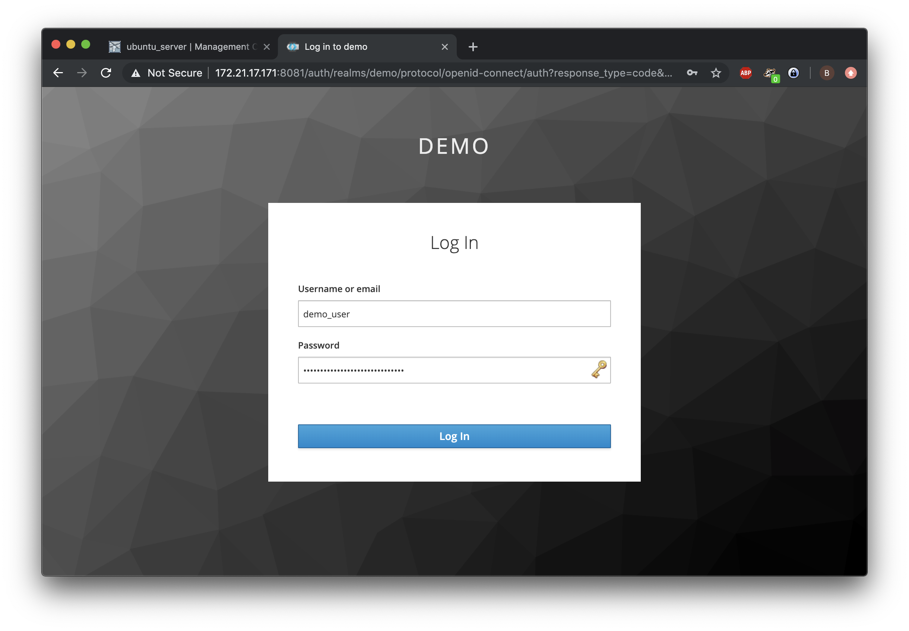

When successful, this will result in a logged-in user and redirects us to the application, which in turn show us the principle ID. 
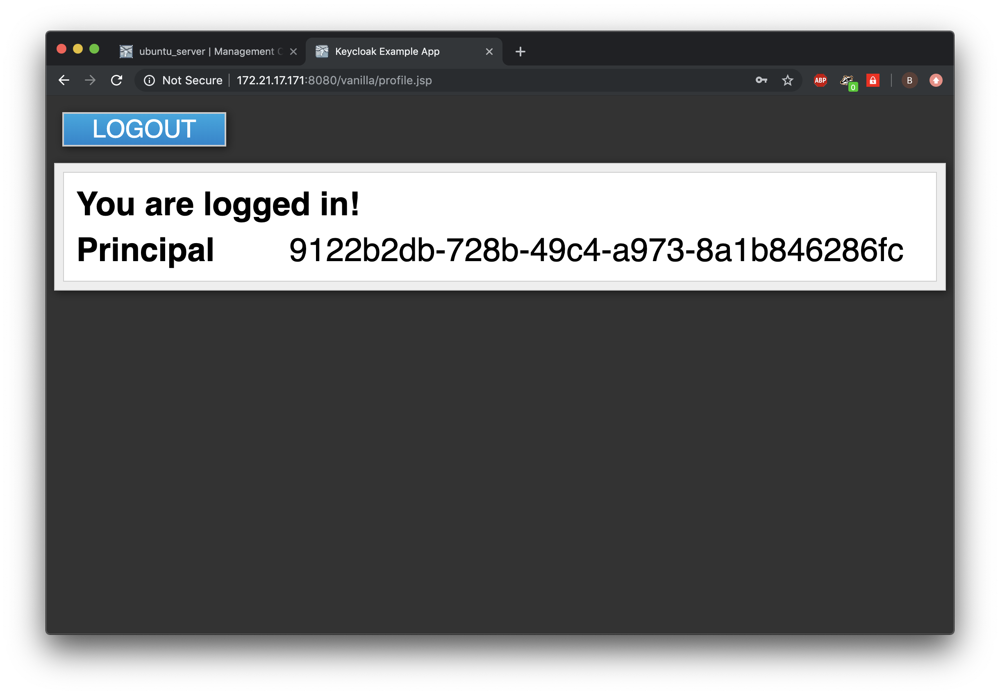

This concludes the tutorial in which we set up both Keycloak and Wildfly, configured a realm, demo-user and a client in this realm and configured an application in Wildfly to use this Keycloak realm as the identity provider for the application.
Apart from the configuration to deploy the application to Wildfly, there were no changes made to the application. The only Keycloak configuration made to connect the application to the identity-provider were done inside the Wildfly configuration.

## Resources
* [Keycloak Getting started](https://www.keycloak.org/docs/latest/getting_started/index.html)
* [Wildfly Getting started](https://docs.wildfly.org/17/Getting_Started_Guide.html)
* [Deploying Maven apps to Wildfly](https://cleanprogrammer.net/deploy-applications-to-wildfly-server-using-wildfly-maven-plugin/)
* [Installing AdoptOpen JDK](https://medium.com/adoptopenjdk/adoptopenjdk-rpm-and-deb-files-7003ba38144e)
