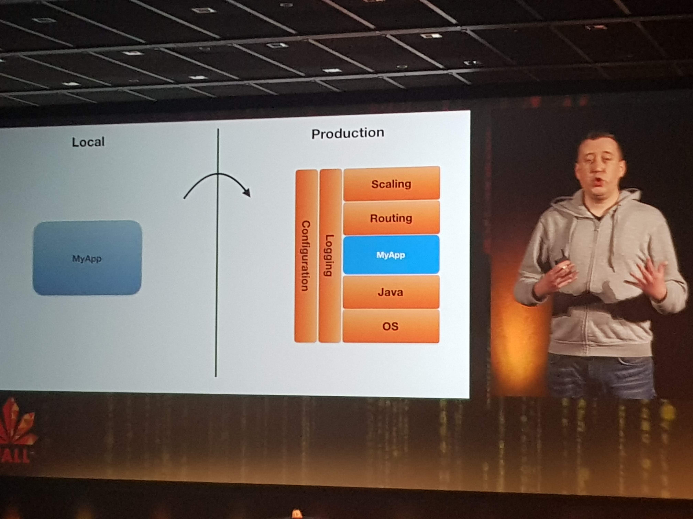

# Master your tools - [Jan-Hendrik Kuperus](https://twitter.com/jhkuperus)

Jan-Hendrik gave an early-bird talk in which he talked about lots of productivity-tools he uses on his MacBook.
Some tools also had Windows and / or Linux alternatives. Most of the tools either help you automate things or access existing workflows or functions using much easier and faster key-bindings.

His alibi for this talk was based on the psychology of our limited ability to spend conscious effort. He advocates simplifying things to free up conscious effort that can be spent on actual creative work instead of losing it to mundane, repetitive and automatable tasks. 
* Conscious effort leads to...
* Cognitive strain, too much of that leads to...
* Ego depletion (as in: "Oh no, not another meeting"-type reactions), which leads to (more impact from)...
* Distraction

Given that having to remind lots of terminal commands, requires more conscious effort, we would like to automate and simplify things alot.
He also showed us an [XKCD chart](https://xkcd.com/1205/) to quickly figure out if the time to automate is worth the effort, although he did confess he was in the grey zone (not worth it) quite a number of times.


Given the time you can shave of by automating something and the number of times you perform this task, how much time could you save over a five year span. If you can automate it within that time, you have a net gain. 

## IntelliJ Idea: 
Jan-Hendrik uses IntelliJ, because of these reasons:
* It's keyboard-centric
* You can declare custom short-cuts
* You can find any action with Command + Shift + A
* It has multi cursor editing, which can
  * Add or remove a cursor
  * Do multi-cursor editing
  * Do column mode
  * Demo looked a bit like [this](https://www.youtube.com/watch?v=X8wwrXXgYQA)
* Live templates to quickly insert often used pieces of code
* Window Splitting for multiple editor windows so you can have code side-by-side
  * Command + Shift + S, then V or H: Splits vertical or horizontal
* Navigating Panels:
  * Command + 1 through 9

## Browser extensions
Jan-Hendrik showed a number of handy Browser extensions, mainly on Chrome. It is unclear how these extensions store your data (in local storage?) and whether they expose your browser-history to the extension's developers.
* Vimium - The hacker's browser: 
  * Navigate with keys H, J, K and L to scroll up, down and to start or end of a page
  * Highlight and navigate Links with key F, then "click" one using the highlighted key-combination above the link
  * Keys G, I: navigate to the first input field
  * Key ? for keymap cheatsheet (which it often is, for instance in GMail)
* Initab was a very interesting plugin for me
  * Enables you to create custom personalized start-page
* OneTab also peaked my interest
  * Aggregates all opened tabs into a single page with links
  * Very handy when you often have many tabs open (which I do, and then some)
* JSON Viewer (Duh)
* EditThisCookie (also good for hacking the apps you are currently developing)
* UA Switcher (don't know what this did anymore)

## Alfred peaked my interest
This is a replacement for Spotlight, which can: 
* Insert snippets like:
  * Mac command characters
  * ASCII art
* Define workflows like Wifi On/Off, Bluetooth On/Off, and many more examples which I don't remember, but were more complex and therefore saved more time
* Searches bookmarks

## Shell magic
* Use your prompt to indicate what you're doing
  * Your prompt mostly displays your current directory
  * Context info (like Git also does by displaying current branch)
  * Display dangerous context (like which environment am I in? Am I working on Office VPN? etc)
* Aliases
  * Shorten long commands by using aliases
* Scripts (learn to bash or Powershell, it's very powerfull. Ask any ethical hacker)
* Key bindings
  * Shortcuts in shell
  * Time tracking
  * Branch switching

## Hammerspoon was incredibly powerful
* Swiss army knife for Mac OS
* Set a key as your Hyper key to activate Hammerspoon 
  * It beats shortcut conflicts
* Can be used for Window Management / move and placement (I use Spectacle for this already)
* App Switching
  * Bind an app to Hyper + some key
* Fun thing to do: You can create a Soundboard using
  * Hyper-Command + anything

## Other
* BarTender can be used to clean up the Mac bar (top right of your screen)
* AnyBar can add icons you DO want in the Mac bar (like green indicators when your build is done)
* Configuration is saved in dotfiles

# Keynote Rabobank on fast deployment to Pivotal Cloud Foundry
The first Keynote was a very nice talk by [Vincent Oostindië](https://nl.linkedin.com/in/vincent-oostindie-7ba2511) and [Wouter Oet](https://twitter.com/wouteroet)


The main focus for them is to abstract away all container-hassle and stuff like configuration, log aggregation, cloud-challenges like scaling and routing etc.




Wouter was visibly nervous as he live-deployed an app (a Flappy-Duke game) to production on Pivotal Cloud Foundry.
He first let us check the [URL](https://www.rabobank.com/jfall/) to see nothing was there. Then he pushed his code to GIT, which built and deployed it to the first server instance, which gave many of the audience access to the app.
But after pushing to the second server, everyone had access. This all took just minutes from his local machine to live on PCF in production.


Yes this was in minutes, maybe even within a minute. Okay, it was "just" some static resources and they skipped all the normal pipeline stuff to do like complex build, testing, quality gates and pull-requests. But still, deploying made so easy and fast is what the end-game of DevOps should be.


As for technology they use at Rabobank, they already use Java 11 and are pushing towards 12.  

# Cryptography 101 by [Michel Schudel](https://www.twitter.com/MichelSchudel)

Michel had worked at Rabobank as well, where he created a Rabobank Crypto toolbox.
In his talk, he explained the basics of Cryptography, which included:
* Hashing
* Symmetric encryption
* Asymmetric encryption
* Signatures
* Certificates

He explained how cryptography can be used for:
* Confidentiality: preventing unauthorized people from reading something they should be allowed to
* Integrity: making sure you know when data is altered by an unauthorized person
* Authenticity: being sure you are communicating with the person you think you are communicating

Note that in the normal CIA triade the A stands for Availability, which should make sure data and systems are available when they should be available, so things like DDoS and Ransomware prevention should handle that.

All classes you need to do all the cryptography stuff in Java isn't even that complex, but you do have to do it correctly and be aware of some small, but important details.
Cryptography is included in:
* Java Cryptography Architecture (used to be mainly the API stuff)
* Java Cryptography Extension (used to be the standard implementation)

These are some options to use as implementations for Cryptography:
* SunJCE: The standard SUN JCE implementation
* Boundy-castle: The well-known Open-source alternative
* Other CSP (like Hardware Security Modules)

The examples are all available in his Github repo [here](https://github.com/MichelSchudel/crypto-demo) and the presentation slide are [here](https://www.slideshare.net/michelschudel/cryptography-101-forjavadevelopers-fall-2019)

As for where the java security stuff is stored in different Java versions, that changed since Java 9:
* JDK8-: jre/lib/security/java.security
* JDK9+: conf/security/java.security

## Hashing

Good hashing algorithms have these properties:
* They are one-way functions, it is impossible to revert back to the same input using the hashed value, much like ```10 MOD 3 = 1``` is irreversible if you only know ```X MOD 3 = 1```.
* It always produces the same hash when feeding the same input (in the same hashing algorithm, of course).
* It produces a completely different hash even with minor changes to the input.
* It never (in practice) produces the same hash for two different inputs. This would be called a collision, which weakens the algorithm.


## Symmetric encryption
Symmetric encryption works on same-size blocks of the original input, which could mess when encrypting repeated data. Basically if the repeated data is the same size as the block size of the encryption, you will see repeated data in the encrypted output as well.
* Fix this by using CBC instead of ECB
* This uses an Initialization Vector (IV) on the first block and the output of the previous block on each next block to encrypt.
As for key-size, use proper length, which is not possible in all Java versions. Since Java8u162 you can use any keysize, since it supports unlimited key-size by default.

But with symmetric key encryption comes a challenge: How do you agree upon a shared, but secret key? That's where the Diffie-Hellman key-exchange helps out:


Unfortunately Michel forgot to mention Ralph Merkle who [conceptualized](https://en.wikipedia.org/wiki/Diffie%E2%80%93Hellman_key_exchange) the exchange method.

## Asymmetric
Asymmetric encryption is much slower and requires longer keys as the data to encrypt gets longer. So it is mostly used for:
* Key exchange to set up symmetric encryption
* Encrypting and decrypting symmetric keys
* Encrypting hashes for authenticity checks


In asymmetric (or private-public) key encryption, communicating partners use a key-pair which is mathematically bound to encrypt and decrypt messages or data.

One key is always private (the secret) and in possession of a single person or entity. The other is public and can be used by anyone.

In the example, Bob wants to send a secret message to Alice. 
* Bob uses the public key to encrypt the message, so it is not readable by anyone except Alice who has the private key.
* Even Bob can't read it anymore, but he may have or remember the original message.
* Alice decrypts the message with her private key and gets the original message

## Signatures

Signatures are used to authenticate data coming from a specific source. For this, we use HMAC: Keyed-hash Message Authentication Code.


By combining hashing with asymmetric encryption, a sender can create a hash of a message, then encrypt this hash using his own private key, which only the sender can do.
This is exactly the other way around as the previous example, where the sender encrypted the message itself with the receiver's (public) key.
Often a combination of encrypting the message (again: with the receiver's public key) and a signature (with the sender's private key) is used to get both confidentiality and integrity.

## Certificates
These handle authenticity. 

Again, everything needed to use (store, validate etc.) certificates uses a small number of classes. Also, these can (and often will) be implemented by a Hardware Security Module, which when done properly, strengthens security of your setup.
* Tip: Don't do certificate generating in Java
* Use the ```Keytool``` to store certificates in the Java keystore.
* Based on a keystore, we can ```keytool -certreq``` and send the output as a certificate request to a Certificate Authority

