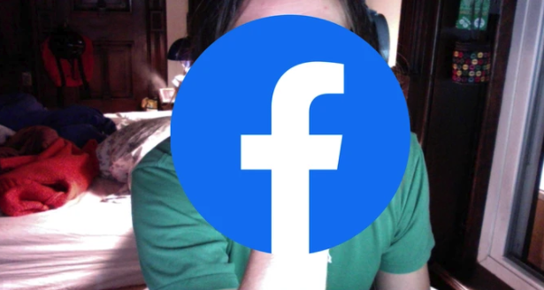

# Zoom, beyond the issues 

We are in the middle of the Corona crisis and just about everybody has to stay home, working from home 
and getting "together" with family and friends using online video conference applications.
This made Zoom's popularity [skyrocket](https://venturebeat.com/2020/04/02/zooms-daily-active-users-jumped-from-10-million-to-over-200-million-in-3-months/) from 10 million to 200 million in three months time. 
Meanwhile, the app is scrutinized for its continued avalanche of privacy and security issues.


# Preface

Zoom has dominated the news for the past month. And while the info-sec community has written a lot about both Zoom and alternative video-conferencing apps,
there is no general consensus in the security community about whether or not Zoom is safe for use in specific scenario's.
Oppinions range from [Zoom is malware](https://www.theguardian.com/technology/2020/apr/02/zoom-technology-security-coronavirus-video-conferencing) (The Guardian) to [Zoom is safe to use](https://www.sans.org/webcasts/downloads/114670/slides) (SANS instructor Mick Douglas).
What is clear, is that Zoom usage has exploded due indirectly to the Covid-19 outbrake, which has caused many of us to work from home (WFH) and even more 
to stay in contact with family and friends, while adhering to the social distancing guidelines.

This blog-post is my personal take on Zoom. I tried to give as many facts (with sources) as possible and included links to Zoom's own communication whenever relevant.
I have not checked the validity of sources referenced in this article, but I've tried to include only respected and established sources. 
Also, I've tried to include information and sources of different views, both in favor and against Zoom's usage.

My view at the time of writing is to avoid using Zoom. As discussed in this blog, I see a real possibility that my view will change.
Why and when? That's what this article is about. 

## TL;DR

* Don't use Zoom

## Slightly less TL;DR

Zoom has had numerous security & privacy incidents up to april 2020. Given their mediocre response, including the ever recurring red-flags in ["privacy and security is our top priority"](https://blog.zoom.us/wordpress/2020/03/29/zoom-privacy-policy/)
and the explanations of their choices and mitigations, the company has a serious lack of security awareness. I advice against using Zoom as your conference software of choice. Below are some alternatives, each with its strong and weak points.

Alternatives are [numerous](https://www.theverge.com/2020/4/1/21202945/zoom-alternative-conference-video-free-app-skype-slack-hangouts-jitsi), including free, multi-user video-conferencing apps:
* Skype Meet now
* Cisco Webex
* Starleaf
* Jitsi Meet
* Whereby
* Google Hangouts (now called Google Meet)
* Google Duo
* Houseparty
* Microsoft Teams

That being said, Zoom's CEO Eric S. Yuan has released a [strong message](https://blog.zoom.us/wordpress/2020/04/01/a-message-to-our-users/) addressing the recent issues, detailing measures it has already taken and listing a number of steps 
it will take in the next days / weeks and foreseeable future. These emphasize on transparency, a major shift from resources to address security and privacy issues and conducting external security reviews.
While I remain sceptical at the time of writing (yes, there's a "We take them extremely seriously"), the tone of the blog is from time to time humbling. Eric S. Yuan recognizes falling short to communities' expectations and apologises.
If they follow the path detailed in their communication and deliver on that promise and continue to improve on security and privacy, I will gladly revisit this post and acknowledge a ship turned around. 
But they should certainly pull all hands on deck to prevent an iceberg collision. 

Sidenote: while most issues are simply a matter of (very) bad, non-existent secure programming or even proactively in-secure software development, some issues could have been avoided by users being a bit less naive and a bit more security aware.
Posting meeting URL's on open social media is a bad practice if you don't know what your doing. So while Zoom is to blame for a lot of the issues, not all of them can be credited fully to them.


## Timeline

The timeline up to April 7, 2020 of incidents related to Zoom (AFAIK):
* 2020-04-10: Zoom [banned](https://www.bbc.com/news/world-asia-52240251) by teachers in Singapore after Zoom-bombing incident
* 2020-04-09: Zoom hires ex-Facebook Security Chief [Alex Stamos](https://www.scmp.com/tech/apps-social/article/3079121/zoom-hires-ex-facebook-security-chief-alex-stamos-google-bans)
* 2020-04-08: Security Researcher [s3c_krd](https://twitter.com/s3c_krd) finds a way to [hack](https://medium.com/@s3c/how-i-hacked-worldwide-zoom-users-eafdff94077d) all Zoom users (down, but [archived](https://web.archive.org/web/20200410111116/https://medium.com/@s3c/how-i-hacked-worldwide-zoom-users-eafdff94077d)) by abusing vulnerabilities in its mail-verification process
* 2020-04-08: Zoom blocked for a major Dutch bank
* 2020-04-08: Google [bans](https://www.buzzfeednews.com/article/pranavdixit/google-bans-zoom) Zoom from employees' corporate laptops
* 2020-04-06: More USA Schools begin to [ban Zoom](https://www.gizchina.com/2020/04/06/zoom-schools-begin-to-ban-the-video-conferencing-platform/) most switching to Microsoft Teams
* 2020-04-05: USA Schools [ban Zoom](https://betanews.com/2020/04/05/us-schools-ban-zoom/)
* 2020-04-03: Zoom banned at Ordina
* 2020-04-03: Bruce Schneier writes a [critical blog-post](https://www.schneier.com/blog/archives/2020/04/security_and_pr_1.html) on Zoom including details on the recent issues
* 2020-04-03: CitizenLab releases extensive details about its [encryption](https://citizenlab.ca/2020/04/move-fast-roll-your-own-crypto-a-quick-look-at-the-confidentiality-of-zoom-meetings/) and the Chinese division of Zoom
* 2020-04-04: Zoom enables [waiting-room and password](https://support.zoom.us/hc/en-us/articles/360041408732-April-2020-Setting-updates-for-free-accounts-and-single-Pro-users) settings by default for all users
* 2020-04-03: Zoom web client [is down](https://www.bleepingcomputer.com/news/technology/zooms-web-client-is-down-users-report-403-forbidden-errors/), returning 403 Forbidden errors
* 2020-04-01: Zoom releases [statement](https://blog.zoom.us/wordpress/2020/04/01/a-message-to-our-users/) addressing recent issues, including mitigations already taken and plans for future mitigations
* 2020-03-30: New York Attorney General started an [investigation](https://www.nytimes.com/2020/03/30/technology/new-york-attorney-general-zoom-privacy.html) into Zoom's privacy & security practices
* 2020-03-30: Numerous reports of [Zoom-bombing](https://twitter.com/dhh/status/1245097507488583681) abusing password-less and sequentially numbered Zoom meetings
  * 2020-03-31: [FBI](https://www.sacbee.com/news/coronavirus/article241643036.html) gets involved, also releasing an [FBI warning](https://www.fbi.gov/contact-us/field-offices/boston/news/press-releases/fbi-warns-of-teleconferencing-and-online-classroom-hijacking-during-covid-19-pandemic)
  * 2020-03-30: [Boston](https://boston.cbslocal.com/2020/03/30/zoom-zoombombing-hack-security-tips/) online class
  * 2020-03-25: [USC](https://www.latimes.com/california/story/2020-03-25/zoombombing-usc-classes-interrupted-racist-remarks) online class Zoom-bombed with racist taunts and porn
* 2020-03-30: Zoom admits to [The Intercept](https://theintercept.com/2020/03/31/zoom-meeting-encryption/) that its use of the term End-2-end encryption differs from the normally used "from end-user to end-user".
* 2020-03-30: Patrick Wardle discovers a [Zoom Mac vulnerability](https://objective-see.com/blog/blog_0x56.html), enabling Webcam hijacking
* 2020-03-30: [Felix Steele](https://twitter.com/c1truz_/) discovers some [shady Zoom installer behavior](https://www.vmray.com/cyber-security-blog/zoom-macos-installer-analysis-good-apps-behaving-badly/) to "easy" the installation process, but luring the user into handing out root privilege to the installer process
* 2020-03-27: Zoom releases [Best Practices](https://blog.zoom.us/wordpress/2020/03/27/best-practices-for-securing-your-virtual-classroom/) to securing virtual classrooms
* 2020-03-26: Zoom [shares](https://www.vice.com/en_us/article/k7e599/zoom-ios-app-sends-data-to-facebook-even-if-you-dont-have-a-facebook-account) user-data with Facebook by using Facebook SDK
    * Zoom [removed](https://blog.zoom.us/wordpress/2020/03/27/zoom-use-of-facebook-sdk-in-ios-client/) the Facebook SDK from its iOS client to address these issues two days after it was notified
    * Although this didn't prevent a user to file a [class action lawsuit](https://www.vice.com/en_us/article/pke4vb/zoom-faces-class-action-lawsuit-for-sharing-data-with-facebook) with Zoom on March 30
* 2020-03-23: Mitch Hines, Red Team Lead at CCSASA, discovers a Zoom Windows vulnerability, enabling [Windows credential stealing](https://www.bleepingcomputer.com/news/security/zoom-lets-attackers-steal-windows-credentials-run-programs-via-unc-links/) and arbitrary code execution
* 2020-03-23: Jeroen Lebon discovers a [GDPR issue](https://twitter.com/JJVLebon/status/1242175850306580486) in Zoom's free client software where Zoom leaks 1000 usernames, mail-addresses and some people's profile pictures.
* 2020-03-20: Zoom releases [How to prevent zoom-bombing](https://blog.zoom.us/wordpress/2020/03/20/keep-uninvited-guests-out-of-your-zoom-event/) BLOG 
* 2019-03-08: Jonathan Leitschuh discovers a [Zoom Mac vulnerability](https://medium.com/bugbountywriteup/zoom-zero-day-4-million-webcams-maybe-an-rce-just-get-them-to-visit-your-website-ac75c83f4ef5) that allowed malicious websites to enable victim's webcam
* 2018-10-11: David Wells discovers a [Zoom vulnerability](https://medium.com/tenable-techblog/remotely-exploiting-zoom-meetings-5a811342ba1d), enabling screen-control hijack, chat message spoofing, kick-banning attendees

## Issues


### The initial bombing & RCE vulnerability

Back in October 2018, David Wells at [Tenable](https://www.tenable.com/blog/tenable-research-advisory-zoom-unauthorized-command-execution-cve-2018-15715) already wrote about exploits that made 
Zoom susceptible to screen-control hijacking, chat message spoofing, kicking and banning attendees and even control the presenter's desktop. This vulnerability was possible due to Zoom at that time handling 
both UDP and TCP packages using the same message handler. That way unauthorized UDP packets could contain messages that where handled in the trusted TCP channel.  

This vulnerability was listed as [CVE-2018-15715](https://cve.mitre.org/cgi-bin/cvename.cgi?name=CVE-2018-15715), disclosed to Zoom at November 11 2018 and a fix was release for Windows and Mac on November 20 and Linux at November 30.


#### Webcam hijacking in 2019

In March 2019, [Jonathan Leitschuh](https://twitter.com/JLLeitschuh) discovers a [vulnerability](https://medium.com/bugbountywriteup/zoom-zero-day-4-million-webcams-maybe-an-rce-just-get-them-to-visit-your-website-ac75c83f4ef5) 
that enables a malicious website to auto-join a user into a Zoom meeting. This would activate the user's webcam, without their knowledge or consent.
This could also fire a Denial of Service on a Mac by repeatedly joining the Mac into an invalid call.
The juicy bit about this vulnerability is the way that Zoom intentionally set up their application's "reinstall feature". If a Mac user ever used and uninstalled Zoom, there would still be a leftover localhost web-server that would 
enable a Zoom-link to quickly reinstall and start the Zoom client again. Jonathan reversed the Zoom background webserver and found a plethora of undocumented features, the webserver itself being the biggest.
In the process he even prevented potential RCE by notifying the Zoom team of a domain expiry that was due in the week up to May 1, 2019. The domain in question, [Zoomgov.com](http://www.zoomgov.com) was one of the domains
checked for Zoom updates. A domain takeover would have enabled attackers to update Zoom with malicious versions. 


The undocumented webserver here was the most important takeaway, since it wasn't removed when a user uninstalled Zoom. In this extremely rare and unique instance, Apple pushed a [silent update](https://www.theverge.com/2019/7/10/20689644/apple-zoom-web-server-automatic-removal-silent-update-webcam-vulnerability)
to fix the issue for Zoom and protecting Mac-users that woud very understandably not be aware of updates and fixes for issues in software they had already uninstalled. 
A week later, Apple pushed [another update](https://www.theverge.com/2019/7/16/20696529/apple-mac-silent-update-zoom-ringcentral-zhumu-vulnerabilty-patched) to fix the same for white-labeled Zoom partners RingCentral and Zhumu.
 
LifeHacker even went so far as to post a guide on how to [remove Zoom](https://lifehacker.com/remove-zoom-from-your-mac-right-now-1836209383) from your Mac, or at the very least disable webcam usage for Zoom by default.

The vulnerabilities are:
* DOS Vulnerability — Fixed in Client version 4.4.2 — [CVE-2019–13449](https://cve.mitre.org/cgi-bin/cvename.cgi?name=CVE-2019-13449)
* Information Disclosure (Webcam) — Fixed in Client version 4.4.4 — [CVE-2019–13450](https://cve.mitre.org/cgi-bin/cvename.cgi?name=CVE-2019-13450)

### Zoom-bombing

Zoom uses a sequential 10-digit number to uniquely identify Zoom meeting ID's. This number is visible on the screen and unless protected by a waiting room and / or password, anyone can join the meeting without limitations.
During the Covid-19 crisis, where lots of businesses needed to go virtual, Zoom got a massive boost in users, obviously increasing the number of Zoom meetings by the same factor.
This enabled random people to start Zoom-bombing into random meetings, just by iterating through meeting-ID's. Not only that, but anyone not in the know would proudly share a screenshot of their virtual meeting
on social media and anyone could at that point bomb the meeting. 

Although the prime-minister of UK Boris Johnson [tweeted](https://twitter.com/BorisJohnson/status/1244985949534199808) a screenshot of their meeting, the meeting was password protected.


While this UK parliament meeting escaped a fiasco by using common sense security practices, it could have been much worse. And for some it did. Several US-based schools 
have suffered from annoying interference to racist taints and porn-spamming malicious actors.

Note that the very first issue on Zoom listed in this article enabled Zoom-bombing back in October 2018 as one of several exploits

Sources:
* [FBI warning](https://www.fbi.gov/contact-us/field-offices/boston/news/press-releases/fbi-warns-of-teleconferencing-and-online-classroom-hijacking-during-covid-19-pandemic)

### Data leaking

Presumably by accident, [several](https://twitter.com/JJVLebon/status/1242175850306580486) [users](https://twitter.com/xs4all/status/1244217058868572163) of Zoom's free for private use client have discovered 
the app to leak 1000's of names, email-addresses and even some profile pictures. Surprising is that both users are based in the Netherlands, which Barend Gehrels confirmed.
The affected domains included at least Xs4all.nl, dds.nl and quicknet.nl , all Dutch ISPs. Apparently the issue was triggered by registering in Zoom
with a mail-address which is not obviously a standard provider like GMail, Hotmail or Yahoo. Users would then gain access to all Zoom users registered on that domain.


Zoom explained this as [intended](https://support.zoom.us/hc/en-us/articles/115004055706-Managing-Contacts) functionality as this enabled contact directories for organizations using the same domain.
The unintended behavior was to be expected: Zoom maintains a blacklist approach to which domains are "organisations" and which are common e-mail providers, any non-company domain that Zoom 
didn't list as a "provider" would be subjected to this vulnerability.

Source:
* [Vice](https://www.vice.com/en_us/article/k7e95m/zoom-leaking-email-addresses-photos)

### Sharing user-data

Zoom, like many other smartphone-apps, uses the Facebook SDK to implement common features. The side-effect being, Facebook gaining access to information of that user, including device type and model,
timezone, city location, phone carrier and unique advertiser identifier. This same issue was discovered on the [iOS client app](https://www.vice.com/en_us/article/k7e599/zoom-ios-app-sends-data-to-facebook-even-if-you-dont-have-a-facebook-account)
by Vice and confirmed by several security researchers. 

Zoom responded within two days (a day after publication) by announcing the planned [removal](https://blog.zoom.us/wordpress/2020/03/27/zoom-use-of-facebook-sdk-in-ios-client/) of Facebook's SDK from the iOS app.
The expected "Zoom takes its users’ privacy extremely seriously" opens Zoom's Blog-post, although they did thank Motherboard for bringing it to their attention.



Being so quick in their response didn't prevent Zoom user Robbert Cullen to file a [class action lawsuit](https://www.vice.com/en_us/article/pke4vb/zoom-faces-class-action-lawsuit-for-sharing-data-with-facebook) 
with Zoom on March 30 for violating the California Data Protection Law.

Source:
* [Bloomberg](https://www.bloomberg.com/news/articles/2020-03-31/zoom-sued-for-allegedly-illegally-disclosing-personal-data)

### NTLM hash leaking and RCE

Discovered by [_g0dmode](https://twitter.com/_g0dmode/status/1242131019026874369) (Mitch Hines, Red Team Lead at CCSASA) and confirmed by [Matthew Hickey](https://twitter.com/hackerfantastic/status/1245133371262619654)
and [Mohammed Baset](https://twitter.com/SymbianSyMoh/status/1245369010709037056), this vulnerability allows an attacker to steal Windows login credentials and even execute arbitrary commands on a targeted system.

The vulnerability is abused by luring the victim to click a malicious link. This will leak the user's NTLM Hash. Sufficiently strong passwords could prevent or severely delay the attack up to making it impractical.
In practice however, sufficiently strong passwords are the exception rather than the norm.

Workarounds using Group Policy are described in the article by Bleeping Computers. 


Sources:
* [Bleeping Computers](https://www.bleepingcomputer.com/news/security/zoom-lets-attackers-steal-windows-credentials-run-programs-via-unc-links/)
* [The Hacker News](https://thehackernews.com/2020/04/zoom-windows-password.html)
* [Ars Technica](https://arstechnica.com/information-technology/2020/04/unpatched-zoom-bug-lets-attackers-steal-windows-credentials-with-no-warning/)
* [Tavis Ormandy](https://twitter.com/taviso/status/1245520529739534338) confirms arbitrary code execution
 
### More shady install issues

On March 30, Felix Steele discovered a [dubious technique](https://www.vmray.com/cyber-security-blog/zoom-macos-installer-analysis-good-apps-behaving-badly/) 
used by Zoom's Mac OSX installer to install itself with minimum user interaction. The installer uses preinstall scripts to unpack the application with a bundled 7zip 
and install Zoom directly to the /Applications directory, something which is normally done explicitly by the user. 
The installer abuses a deprecated Mac OSX API call ```AuthorizationExecuteWithPrivileges``` to gain privileged access, triggering a faked credential-dialogue if needed.


As stated in the blog-post, there is no need for this faked password-prompt and instead it conditions users to ignore signs of security issues.
A security aware user should have immediately caught the typo's in the fake dialogue, a social engineering attack already abused in Malware like Coldroot and Proton.

### End-2-end encryption

Let's make one thing clear: implementing real end-2-end encryption in group video conference calls is hard. More even when you want to do it
in such a way that nobody other than the communicating parties know the key. Having the person talking highlighted is even harder, but doable. Apple FaceTime does exactly that and is truly end-2-end encrypted 

Zoom's documentation stated that it used AEX-256 encryption, while it actually used AES-128 keys. But using 128-bit instead of 256-bit key-length [isn't](https://www.eetimes.com/how-secure-is-aes-against-brute-force-attacks/#) really the issue.
It's the use of ECB-mode what's bad.


As you can see from the example above, using ECB mode reveals patterns in the data, which are revealed as patterns in the encrypted data as well.

Diving deeper in the encryption used by Zoom, CitizenLab learned that Zoom uses their own encryption scheme, [which](https://www.csoonline.com/article/2119351/a-field-guide-to-spotting-bad-cryptography.html) is a [bad](https://its.ny.gov/sites/default/files/documents/2bruce_barnett.pptx.pdf) [idea](https://www.schneier.com/essays/archives/1998/01/security_pitfalls_in.html).
Communications where routed through China while communicating parties were in USA and Canada, which is very concerning. Zoom has [admitted](https://betanews.com/2020/04/04/zoom-china/) this sometimes happens, but failed to mitigate the issue.
The article by CitizenLabs describes in detail the questionable encryption implementation Zoom uses and even tiptoes on an undisclosed issue with Zoom's waiting room feature.


Sources:
* [Zoom](https://blog.zoom.us/wordpress/2020/04/01/facts-around-zoom-encryption-for-meetings-webinars/)
* [The Intercept](https://theintercept.com/2020/03/31/zoom-meeting-encryption/)
* [CitizenLab](https://citizenlab.ca/2020/04/move-fast-roll-your-own-crypto-a-quick-look-at-the-confidentiality-of-zoom-meetings/)

## Conclusion

Zoom gained the spotlight overnight, due to its explosive growth. Security news-sites can easily attract readers by writing a quick story on its long list of failures (me included, although this article took a week to write).
At the same time, both security researchers and malicious actors pile on top of it, to find and either abuse or responsibly disclose their findings, with or without a detailed article to boot.
This has certainly boosted the number of findings and bad-news reports for Zoom. But I'm confident this would not have happened if Zoom's internal security awareness was up to standards.
I've often talked about [information security](https://github.com/brampat/security/blob/master/publications/presentation/security_principles.md) in general and [application security](https://github.com/brampat/security/blob/master/publications/presentation/ssd.md) specifically.
Had Zoom followed secure software development (SSDLC) practices, then there would be much less bad-news surrounding their software and any bad-news would have been turned into trust by authentic transparency.
The steps discussed in Zoom's [april 1st](https://blog.zoom.us/wordpress/2020/04/01/a-message-to-our-users/) (I so strongly hope it's a bad coincidence) could be a turnaround point.
And although I'm still sceptical, I strongly hope they will turn this ship around. Because if everyone follows SSDLC, the world as a whole will be safer because of it.
We, as security professionals can help them and others achieve this, because security is not like pie, where you have less if you share; instead, security is like joy: it becomes more.

Follow me on [Twitter](https://twitter.com/brampatelski) if you want to join me in sharing about application security.

## Sources
* [VentureBeat](https://venturebeat.com/2020/04/02/zooms-daily-active-users-jumped-from-10-million-to-over-200-million-in-3-months/): Zoom skyrockets from 10 to 200 million users
* [The Verge](https://www.theverge.com/2020/4/1/21202945/zoom-alternative-conference-video-free-app-skype-slack-hangouts-jitsi): Alternatives to Zoom

### Pro Zoom
* Nuanced article by [The Hacker News](https://thehackernews.com/2020/04/zoom-cybersecurity-hacking.html) giving an extensive list of issues, explaining both sides of the argument
* SANS instructor Mick Douglas releases [slides](https://www.sans.org/webcasts/downloads/114670/slides) from a SANS presentation on why Zoom "is safe to use" with extensive tips to safely and securely use Zoom

### Con Zoom
* [CitizenLab](https://citizenlab.ca/2020/04/move-fast-roll-your-own-crypto-a-quick-look-at-the-confidentiality-of-zoom-meetings/)
* [The Guardian](https://www.theguardian.com/technology/2020/apr/02/zoom-technology-security-coronavirus-video-conferencing)
* [Bruce Schneier](https://www.schneier.com/blog/archives/2020/04/security_and_pr_1.html)
* [The Guardian](https://www.theguardian.com/technology/2020/apr/02/zoom-technology-security-coronavirus-video-conferencing): Zoom is malware

### Zoom security tips
* [The Hacker News](https://thehackernews.com/2020/04/zoom-cybersecurity-hacking.html)
* [Forbes](https://www.forbes.com/sites/kateoflahertyuk/2020/04/03/use-zoom-here-are-7-essential-steps-you-can-take-to-secure-it/)
* [BetaNews](https://betanews.com/2020/04/03/zoom-privacy-security/)

### Zoom official
* [Zoom Security](https://zoom.us/security) central
* [Zoom Security](https://zoom.us/docs/doc/Zoom-Security-White-Paper.pdf) whitepaper
* [About Zoom's encryption](https://blog.zoom.us/wordpress/2020/04/01/facts-around-zoom-encryption-for-meetings-webinars/)
* [Privacy policy](https://blog.zoom.us/wordpress/2020/03/29/zoom-privacy-policy/)
* Transparency [message to to our users](https://blog.zoom.us/wordpress/2020/04/01/a-message-to-our-users/)
* Zoom configuring [Secure Defaults](https://support.zoom.us/hc/en-us/articles/360041408732-April-2020-Setting-updates-for-free-accounts-and-single-Pro-users)
* Zoom's use of [Facebook SDK](https://blog.zoom.us/wordpress/2020/03/27/zoom-use-of-facebook-sdk-in-ios-client/)
* Zoom [bombing](https://blog.zoom.us/wordpress/2020/03/20/keep-uninvited-guests-out-of-your-zoom-event/) advice
