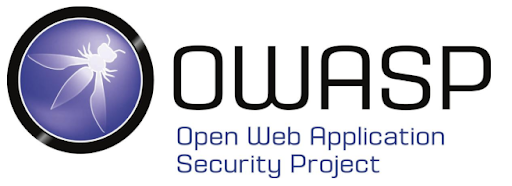
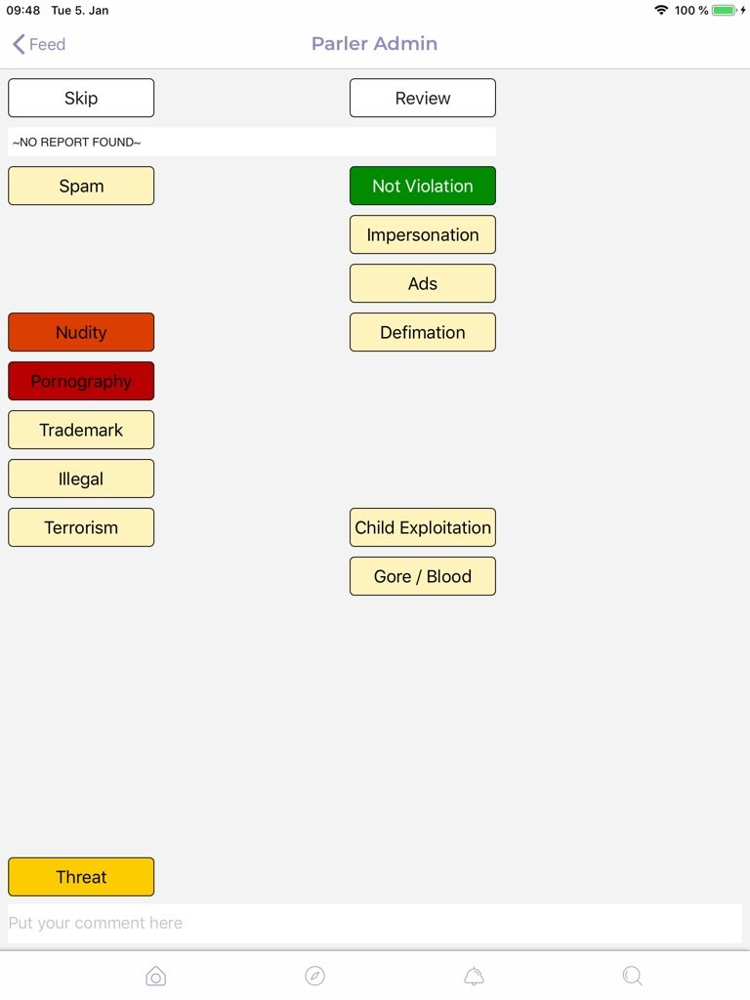
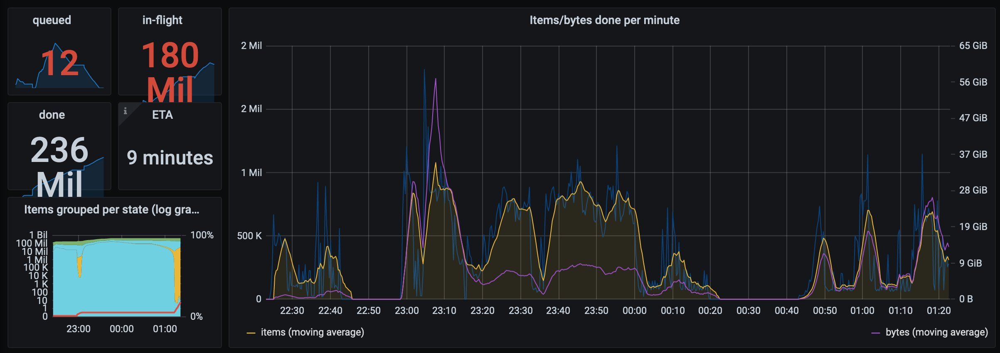

# Parler-tricks

What do you get when you combine hacking, opensource intelligence, lack of secure software development, crowdsourcing and Docker into a blender?

70 TB of Parler data.

## TL;DR

Security researchers hacked Parler and scraped 70 Terabytes of data from the platform in the run-up to Amazon shutting down the platform. Lessons to learn from this are;
* Develop your software with secure defaults and safe failure-state in mind.
* Beware of vendor dependencies and prepare for issues. 
* Sensitive data should stored using proper encryption.
* Prioritize security requirements properly and link these to functional requirements.

## Disclaimer
In this post, I try to be as objective as possible. It should not be a surprise, that I have my own political preferences, including an opinion on current events in the USA and the world in general. I wrote this post, not to judge anyone's preferences or actions. It is not my job to judge, there is a legal system in place to do this. Whether this system works as intended or to anyone's advantage is an entirely different question, which I will not dive into. I do acknowledge the need for standing up for justice and actively defending society against violence or injustice. This blog-post is not about that. Maybe I'll write a post on that later, but this post is not about that. This post is about what happened to Parler, how it happened and what lessons can be learned from it.

In this post, I will indicate the relevant issues with OWASP Top 10 codes where X is a number from 1 to 10:
* (A-X): see OWASP Web Application Security [Top 10 2019](https://owasp.org/www-project-top-ten/)
* (API-X): see OWASP API Security [Top 10 2019](https://owasp.org/www-project-api-security/)
* (M-X): see OWASP Mobile [Top 10 2016](https://owasp.org/www-project-mobile-top-10/)
* (C-X): see OWASP Proactive Controls [Top 10 2018](https://owasp.org/www-project-proactive-controls/)

## What is this all about?

For those living their lives in a Netflix cocoon and not (yet?) having seen "Death to 2020": there's something going on in the USA. Disregarding your political preference or what you think of the things that happened at the Capitol, the hack / leak of social media platform Parler is something quite interesting, to say the least. This blogpost tries to detail the lessons to learn from this case, both from a security and a business continuity viewpoint. And yes: security is simply a part of business continuity, both in the availability-aspect as well as the confidentiality and integrity aspect. Because if you fail on those, at best your reputation will be damaged, worse you will face lawsuits and claims, or worst your company will not survive.

## Some important facts

If you don't know, now you know. Here is some required knowledge, which you may not yet know if you lived in your own bubble. There's nothing wrong with that, I don't judge. But these facts are important to know for this blogpost to make sense.

### Audience
Parler is a social media platform. It was founded in 2018 and calls itself an "unbiased social media" on which its users can "speak freely and express yourself openly without fear of being 'deplatformed' for your views". Around November 2020, it had around 10 million registered users and between 2.3 million (daily) and 4 million (monthly) active users. About 2 million Parler users follow the Trump Campaign team account on Parler. Trump himself does not have a Parler account. Parler's CEO tried to get liberal influencers on the platform, even offering $20k as a bounty for the best liberal account user, based on Parler engagement.

### Technology
Parler is built on Amazon Web Services and used Twilio for email- and phone-number verification. It had both an Android app and an iOS app. Other services it used are Okta for Identity and Access Management and Zendesk.

## Timeline

### Wednesday, January 6
Pro-Trump people gain unauthorized physical access to the Capitol. Again, I'll leave it at that and let others decide on the correct terms to describe the people involved and what actually happened.

Bellingcat [requests](https://twitter.com/bellingcat/status/1346925875661565958) its followers to scrape and archive videos, livestreams and other data of the events.

### Thursday, January 7
IntelliX [set up](https://twitter.com/_IntelligenceX/status/1346967229187952644) a public 80+ TB sized FTP to upload material. Within a day, they [received](https://twitter.com/_IntelligenceX/status/1347581599030910977) about 1500 files totalling 100 GB. 

Several security researchers start to research ways to systematically scrape social media for material. 

### Friday, January 8
On Friday morning, Apple required Parler to put effective moderation in place to reduce and remove posts with illegal content, including (calls for) violence or sedition. The ultimatum gave Parler 24 hours to come up with a plan to implement this.

Google later that day, removed Parler from its app-store without an ultimatum, effectively blocking Android users from downloading the app and thereby halting the growth of the platform significantly. Users that already had the app installed, could still use the platform.

Twilio sent a letter to Parler, informing them of violating the Acceptable Use Policy of its services. Parler uses Twilio to verify user's mail-addresses and phone-numbers, including SMS-authentication. 

### Saturday, January 9
Apple removed the Parler app as well, after it notified the company of its failure to (detail a plan to) implement effective moderation on the platform to address "threats to people's safety". Similar to the removal of Android's Parler app, existing Parler users on iOS could still use the app.

Hacker [Crash Override](https://twitter.com/donk_enby) who was already reverse engineering Parler's Android app (M-9) prior to the events at the Capitol, details how Parler admins already had tools to moderate posts. She also scraped 100k URLs from Parler which included US Capitol related posts. 

Expecting an Amazon take-down of Parler, she advised her followers on Twitter to help in the effort to preserve the material, a prophecy that came true the next day.

### Sunday, January 10
Apparently during the morning of January 10, Twilio permanently suspended Parler's account.

Amazon announced it would shut down Parler's servers on 11:59 pm that day on the Amazon Web Services platform. Amazon justified its action by stating Parler "poses a very real risk to public safety". By doing so, Amazon effectively shut down Parler completely.

Hacker Crash Override mentioned a number of exploits, including an existing XSS exploit (A-7) enabling the upload of arbitrary files to be served on Parler's Video API. 

A hacker from the Anonymous collective [RealOGAnonymous](https://twitter.com/RealOGAnonymous) finds out the suspension of Parler on Twilio disables verification and opens up Parler completely (A-2). One of the exploits used enabled the hackers to create batches of Parler users (A-2), including admin accounts to abuse and systematically scrape all data from Parler. Since these accounts had admin access, they could also [scrape private messages](https://twitter.com/BirdRespecter/status/1348557067351519234), driver's licenses (A-3, M-5) that were used to get a verified Parler Citizen status and potentially "deleted" content. Although a number of sources question the legitimacy of this exploit and expect other exploits to have caused the databreach.The Anonymous hacker [claimed](https://twitter.com/RealOGAnonymous/status/1348223927907213323) to be abusing the exploit to scrape all sensitive and / or private data as well. However, there seemed to be no need for these socket-accounts for most of the scraping.

Crash Override details how video and image files contain raw metadata, including GPS location (API-3). She also details an unauthenticated [IDOR exploit](https://twitter.com/donk_enby/status/1348296642324213760) (A-5) that enables anyone to sequentially download all media from the platform (M-4, API-1). A [Docker image](https://twitter.com/donk_enby/status/1348342847678906370) was employed to automatically scrape Parler. As Crash Override describes it: "a bunch of people running into a burning building trying to grab as many things as we can". The Docker support comes from The [Archive Team](https://archiveteam.org/index.php?title=Running_Archive_Team_Projects_with_Docker) which dedicates its work from preserve internet data from being lost. 

Topping up to 1.6 Gbps, they were able to preserve (almost) all of the Parler content, totalling more than a million video's and 70 to 80 Terabytes of data.

During the scraping efforts, Okta was notified of the use of its services by Parler. Okta provides Identity and Access Management. They [responded](https://twitter.com/okta/status/1348191370528256002) to the Tweet that Parler was using a trial instance of its services and terminated access. In their statement they claim to "support organizations across the political spectrum [but their] platform will not be used for threats of violence and illegal activity".

Also, Zendesk seems to have [suspended](https://twitter.com/RealOGAnonymous/status/1348308997439430656) Parler's account on 11:59 pm on January 10 as well. 

Meanwhile, Parler CEO John Matze [explains](https://video.foxnews.com/v/6221679825001#sp=show-clips) on Fox News how his company had to deal with the bans by Apple, Google and Amazon, destroying its business. Along with the Tech companies, Matze said the company was "ditched" by its lawyers, making it very unlikely the company would recover: "every vendor, from text message services, to email providers, to our lawyers, all ditched us... on the same day."

### Monday, January 11
Parler's app and website are down. 

In the aftermath, multiple news-outlets, including [Vice](https://www.vice.com/en/article/jgqbex/parler-is-gone-but-hackers-say-they-downloaded-everything-first), [Gizmodo](https://gizmodo.com/every-deleted-parler-post-many-with-users-location-dat-1846032466) and [Wired](https://www.wired.com/story/parler-hack-data-public-posts-images-video/) reported on the story. Here are some interesting bits.

According to Vice, Parler didn't actually delete posts from users but flagged them as "unviewable". The Vice article is heavily based on Crash Override's Twitter posts, but I've not seen her claim this. In a post, she did suggest it _may_ include deleted or private posts.

Vice also describes big streams of Parler and Twitter users towards Social Media platform Gab and Telegram channels. It should be noted that Gab experienced similar challenges hosting its services and was taken [offline](https://edition.cnn.com/2018/10/29/tech/gab-offline-pittsburgh/index.html) for a short period in 2018 following the Pittsburgh Synagogue shooting.

Wired confirmed the IDOR vulnerability, stating that Parler lacked basic security measures. The combination of IDOR and the lack of rate limiting allowed anyone with enough bandwidth to completely download all content from Parler.

## Lessons to learn

### Fallback to safe state
One of the important failures was not blocking unauthenticated access which enabled this hack (A-2). The moment Twilio decided to cease their services to Parler, researchers found out the option of registering / taking over accounts on the platform and snowball it out of control. The most important lesson here, is that you should always block or fall-back to a safe state when something unexpected happens (C-7 sub 3: Deny by Default). 

### Reverse engineering
APK's and iOS apps can be reversed and therefore should be considered public information (M-9). The app itself is not a good place to store secrets nor is the app a good location for executing validation. Think of a mobile app as being similar to a website. The code is executed on the client's side and can be modified. Therefore the integrity of client-side code and requests should not be trusted.

Use the OWASP Mobile [Top 10](https://owasp.org/www-project-mobile-top-10/) to identify the most common security risks. The OWASP Mobile Security [testing guide](https://owasp.org/www-project-mobile-security-testing-guide/) can help with testing Mobile apps for security issues.

### Secure your API's
Following up on this point, make sure your API's are properly secured. As seen in this post, several vulnerabilities enabled exploits that ignoring the mobile app altogether and simply calling the API directly (M-4). Since the API accessed resources with a simple increasing identifying number, it was easy to enumerate and scrape all media and messages. This is called an IDOR or Indirect Object Reference. Abusing these vulnerabilities using automated scripts outside of the dedicated app is a common and easy method of exploiting Mobile Apps consuming API's. Not properly enforcing user authentication (A-5) and lack of rate-limiting (API-4) furthermore enabled mass-scraping using these automated tools.

Use the OWASP [API Security](https://owasp.org/www-project-api-security/) project to identify the most common API security issues.

### Protect sensitive data
There is a very important statement regarding data: You cannot lose data you don't have. As soon as a user uploads media, the platform could have scrubbed the metadata from the files. This way, the sensitive data such as GPS-coordinates would not have been leaked (API-3). Also, the need to keep documents for verification of a user's identity is debatable. As soon as a user is verified, the documents may no longer be needed. These documents could be moved to a separate (offline) storage, to prevent them from being leaked. At the very least, these documents should have been stored using encryption (A-3, M-5, C-8).

Another thing to note, is that data that was allegedly deleted by users was still present in the system, but marked as "deleted". Unless there are legal obligations, data should properly be deleted whenever the user requests a deletion. Users expect this and not doing so will have a negative impact on the reputation of the platform. Again: you cannot lose data you don't have.  

### Logging, monitoring and alerting
Would there have been proper logging in place, which was being monitored, alerted and acted upon (A-10, API-10, C-9), then all scraping activities would have been noticed. This would have enabled Parler to block these efforts (API-4). If there is unusual activity, for instance lots of similar requests in a very short amount of time, this is a strong indication of abnormal API usage. These could not have been regular users. 

### Vendor lockin
Maybe the hardest problem to tackle. Don't rely on a single platform. As can be concluded by the collective actions of Google, Apple, Amazon, Twilio and Zendesk, a platform cannot feasibly exist without (business) support of these platforms. Google's App Engine Cloud platform would have made similar choices as Amazon did, based on the boot the mobile-app got. It can be expected that Microsoft's Azure platform would make similar decisions as would IBM and Oracle. Chinese Tencent or Alibaba Cloud offerings would not be a viable option for obvious reasons. 

The challenge for new businesses is, you only have these options:
* Use existing cloud platforms and adhere to their terms of service. Depending on your business and target audience, these terms could be reasonable or not.
* Build your own, which requires an unreasonable up-front investment. This option is not feasible for any new social-media platform, nor will it be for any business not capable of starting a Cloud service that could compete with the big cloud-platforms itself.

For existing businesses, this risk could possibly be decreased by scaling over multiple platforms. This however, brings lots of architectural challenges and will probably not effectively mitigate the risk. We've seen in this post, that Parler was barred from just about all platforms over the course of a few days.

### Underlying problem
All these issues are only symptoms of the underlying problem: no priority for security. This platform was probably built on the need to provide a platform for a specific audience that was (or at least felt like it was) denied access to the established social media platforms. The company's team was about 30 person strong. These numbers pale in comparison to Google, Facebook and Twitter development teams. And those platforms still have their security issues from time to time. It is completely unreasonable to expect at least the same level of secure software practices from this team as the bigger platforms have.

But it all boils down to what the security requirements were, which was probably none or not explicitly mentioned. The need for extra user-functionality to increase the number of users was probably the priority. What people often forget, is that security makes sure this functionality works as intended, works _only_ as intended and keeps working as intended. Adding extra features for legitimate users improves the user experience. But it is just as important to limit (unintended) functionality for illegitimate users. In this case, it enabled a lot of unintended functionality as promised on Parler's front-page: "Parler believes that people are entitled to security, privacy, and freedom of expression. All personal data is kept confidential, and never sold to third parties." 

## Sources

* [Wired](https://www.wired.com/story/parler-hack-data-public-posts-images-video/)
* [Cybernews](https://cybernews.com/news/70tb-of-parler-users-messages-videos-and-posts-leaked-by-security-researchers/)
* [Gizmodo](https://gizmodo.com/every-deleted-parler-post-many-with-users-location-dat-1846032466)
* [Parler](https://en.wikipedia.org/wiki/Parler) on WikiPedia
* [Timeline](https://www.fastcompany.com/90592961/parler-got-destroyed-this-weekend-a-timeline) by Fastcompany
* [Archive Team](https://archiveteam.org/index.php?title=Running_Archive_Team_Projects_with_Docker) Docker image
* [What is Parler](https://edition.cnn.com/2021/01/10/tech/what-is-parler/index.html) on CNN
* [Parler](https://web.archive.org/web/20210501000000*/www.parler.com) on the Internet Archive
* [CloudComputing News](https://cloudcomputing-news.net/news/2021/jan/11/aws-and-twilio-cut-ties-with-parler-after-us-capitol-riots/) on Amazon and Twilio cutting ties with Parler.
* [InputMag](https://www.inputmag.com/culture/parlers-user-data-is-leaking-but-no-ones-really-sure-how)

Twitter:
* Twilio's [Statement](https://twitter.com/twilio/status/1348719143172927491)
* [Crash Override](https://twitter.com/donk_enby)
* [RealOG Anonymous](https://twitter.com/RealOGAnonymous)
* [IntelligenceX](https://twitter.com/_IntelligenceX)
* [Bellingcat](https://twitter.com/bellingcat)
* [BirdRespecter](https://twitter.com/BirdRespecter/status/1348557067351519234)

OWASP:
* OWASP [Top 10](https://owasp.org/www-project-top-ten/) Web Application Security Risks
* OWASP [Top 10](https://owasp.org/www-project-api-security/) API Security Risks
* OWASP [Top 10](https://owasp.org/www-project-mobile-top-10/) Mobile Applocation Risks
* OWASP [Top 10](https://owasp.org/www-project-proactive-controls/) Proactive Controls
