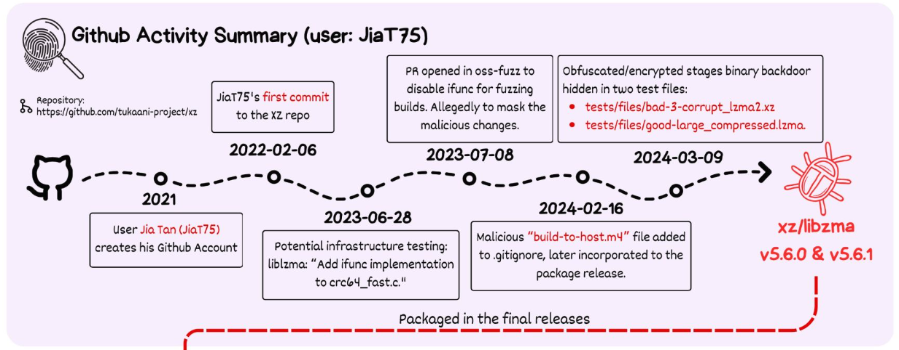

### Understanding Software Dependencies: Risks, Responsibilities, and Resolutions

In recent years, the world of software development has seen high-profile incidents tied to software dependencies. One of the most impactful was Log4Shell, a critical vulnerability in the Log4j library, which is used across countless software applications globally. This single flaw exposed systems to remote code execution, causing widespread panic and demanding immediate action from developers worldwide. Similarly, the discovery of a supply chain attack on XZ-Utils, a compression utility library, demonstrated how deeply embedded issues can ripple through software ecosystems. These cases underscore the serious impact software dependencies can have on security, reliability, and trust, when managed insufficiently.

### Software Dependencies: The Double-Edged Sword

Dependencies are an integral part of modern software development. They allow developers to use pre-built functionality, save time, and focus on core business logic instead. Whether it’s using popular frameworks like Spring or logging libraries like Log4j, dependencies provide immense value. However, this reliance comes with risks, including:
- **Vulnerabilities in Third-Party Code**: Flaws in dependencies can expose your software to attacks.
- **Maintenance Overhead**: Keeping dependencies up-to-date is essential but challenging, especially in large projects.
- **Complexity in Tracking Dependencies**: Identifying and managing all direct and transitive dependencies over multiple projects and deployments can be daunting.

### Choosing the Right Dependencies

Selecting the right dependencies is crucial for reducing risks and ensuring project success. Key (soft) indicators to evaluate dependencies include:

- **Community and Maintenance**: Active communities and frequent updates indicate a well-maintained library.
- **Documentation Quality**: Comprehensive documentation makes it easier to integrate and troubleshoot.
- **Security History**: Check for a track record of how quickly maintainers of libraries address vulnerabilities with a fix.
- **Usage and Adoption**: Widely used libraries are more likely to be vetted by others and supported by tooling.

Limiting the number of direct dependencies also reduces the overhead of maintenance. Fewer dependencies mean fewer updates to manage, fewer potential vulnerabilities, and less complexity when tracking transitive dependencies. Balancing functionality with simplicity is important to maintain long-term project health.

*Visual reconstruction of Java Spring framework Dependency tree*

### Consumers' Responsibilities: Managing Dependencies Safely

When developing software using libraries, developers are essentially consumers of components they use, to create an end-product. When choosing components, they take on the responsibility of these components when considering quality and security of both their end-product. The following activities help developers find areas of concern:

- **Use Software Composition Analysis (SCA)**: SCA tools help identify vulnerabilities in dependencies. OWASP’s Dependency-Check is a well known opensource tool that scans project dependencies against known vulnerabilities. There are many commercial alternatives, such as Snyk and NexusIQ. 
- **Maintain Up-to-Date Dependencies**: Regular updates reduce the risk of unpatched vulnerabilities. Regular small updates decrease the risk of compatibility issues and increase the experience in upgrading and deployment. Automation helps to keep the time spent low.
- **Implement Policies for Dependency Usage**: Restricting the use of unsupported or poorly maintained libraries minimizes exposure to risks. Within larger organisations, it's hard to monitor compliance to policies over all teams and all projects. Use internal dependency repositories like Artifactory or Nexus Repository for all development pipelines. This helps in monitoring compliance with policies and locate projects that use problematic dependencies.

### Producer Responsibilities: Delivering Transparent Software

Developers producing software for clients or broader distribution should provide a clear and comprehensive Software Bill of Materials (SBOM) with their products. An SBOM provides a detailed inventory of the components in a piece of software, offering:

- **Transparency**: Clients can identify potential vulnerabilities and assess risks.
- **Compliance**: Many industries and regulations now require SBOMs.
- **Trust**: SBOMs show proactive risk management, which contributes to client confidence.

Tools like OWASP Dependency-Track facilitate the creation and management of SBOMs, while integrating within development pipelines.

### Supply Chain Attacks: A Growing Threat

A software supply chain attack occurs when attackers compromise a dependency or other third-party components to infiltrate downstream systems. These attacks have risen in sophistication and frequency. Both SolarWinds breach in 2020 and XZ-Utils backdoor in 2024 are demonstrations of the impact successful supply chain attacks have. 

Starting in 2021, a malicious actor slowly built up trust using social engineering and co-conspiring with another malicious entity in the liblzma project. Lzma is a compression algorithm used in the XZ-utils library. By infecting the Lzma library, the malicious actor could indirectly compromise the sshd executable, responsible for SSH connections.

*Full analysis on [Ars Technica](https://arstechnica.com/security/2024/04/what-we-know-about-the-xz-utils-backdoor-that-almost-infected-the-world/)*

To mitigate these risks, developers should:

- **Adopt CycloneDX**: CycloneDX is a standard format for SBOMs that supports tracking dependencies and vulnerabilities.
- **Automate Security Processes**: Integrate tools like Dependency-Track into CI/CD pipelines for continuous monitoring and inclusion of SBOMs with the end-product. Use quality gates to block vulnerable dependencies from entering production code. Continuously scan current production code to alert on newly discovered vulnerabilities.   
- **Pull requests with four or six-eyes principle**: Enforcing pull-requests with 4 or 6 eyes principle decrease the risk of including malicious code into the end-product. Train developers in secure code reviews and watch out for click-through approvals without actually reviewing the code.
- **Collaborate Across Teams**: Security, development, and operations teams must work together to identify and respond to threats. Understanding each other's role creates shared sense of responsibility and improves collaboration, especially during emergency situations.

### Tools to Navigate the Dependency Landscape

The OWASP community offers several invaluable opensource tools to support dependency and supply chain management:

1. **OWASP Dependency-Check**: Scans project dependencies for known vulnerabilities.
2. **OWASP Dependency-Track**: Provides a platform for managing SBOMs and monitoring vulnerabilities.
3. **CycloneDX**: A widely adopted standard for creating SBOMs.
4. **Defect Dojo**: A tool to aggregate findings from many different SAST and DAST tools (Static and Dynamic Application Security Testing) and many different projects into a single dashboard.

These tools empower developers to manage dependencies effectively, mitigate risks, and deliver more secure software.

### Conclusion

The impact of software dependencies on modern development cannot be overstated. By understanding the risks and adopting proactive strategies, both as consumers and producers of software, developers can improve the security of their projects and increase their clients’ trust. Using tools like OWASP Dependency-Check, Dependency-Track, and CycloneDX ensures that dependencies remain assets rather than liabilities in your software ecosystem.

High-profile incidents like Log4Shell and XZ-Utils' backdoor are stark reminders of the stakes involved. However, with collaboration and the right tools, developers can navigate the complexities of software dependencies, building robust and secure applications that stand the test of time.

