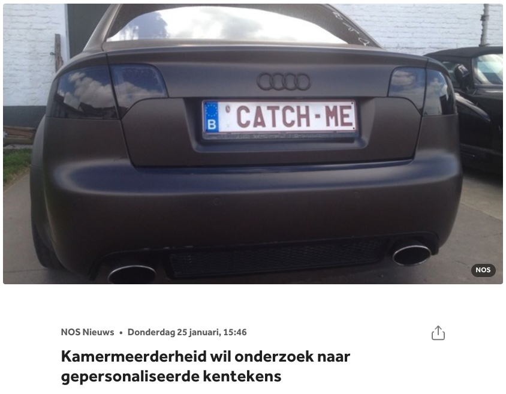
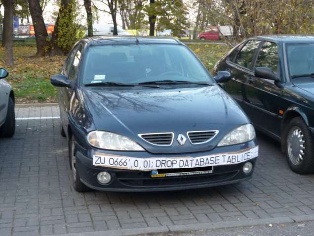
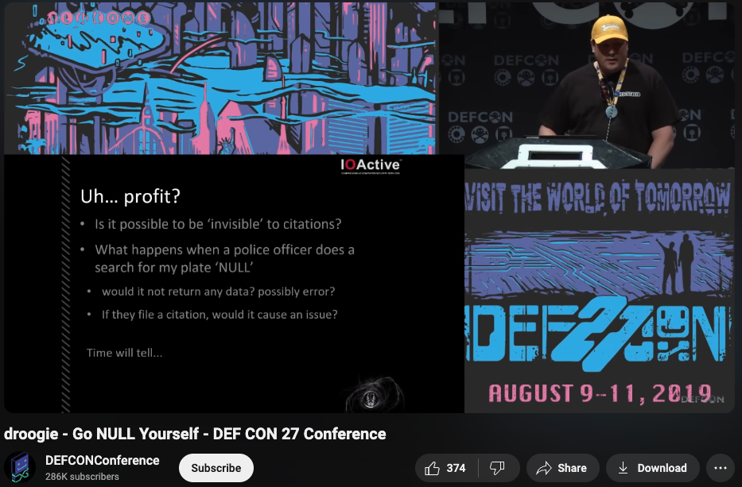
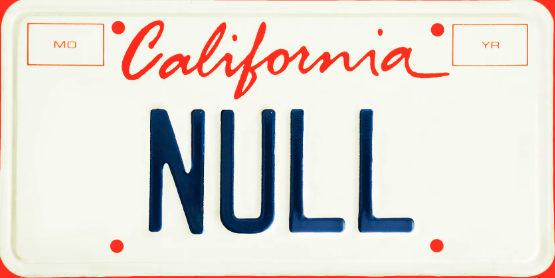

<!-- .slide: data-background="#FFFFFF" style="text-align: left; vertical-align: middle; color:white" color="#FFFFFF" -->
# Security by Meme<!-- .element style="color: #DB8831;" -->

## Less FUD, more FUN<!-- .element style="color: #DB8831;" -->

<!-- .element style="position: fixed; top: 300px; left: 60px; height: 200px;"  -->

<!-- .element style="vertical-align: middle; background:none; border:none; box-shadow:none; position: fixed; bottom: 80px; right: 20px; width: 440px" -->

-- Notes --

This is the first awareness lesson:
* Don't plug in random USB sticks
* You never know what's on them
* Before you know, you're infected with a virus

--

## Agenda

* Physical security
* Machine Learning & AI
* Code Quality
* Cryptography
* Password Security
* Bonus memes (if time)

-- Notes --

--

## Vanity number-plates

<!-- .element class="center-xy" style="background:none; border:none; box-shadow:none; position: fixed; bottom: 0px; right: 0px; width: 700px;" -->

-- Notes --

--

## SQL Injection

<!-- .element class="center-xy" style="background:none; border:none; box-shadow:none; position: fixed; bottom: 0px; right: 0px; width: 700px;" -->

--

## Won't work

<!-- .element class="center-xy" style="background:none; border:none; box-shadow:none; position: fixed; bottom: 0px; right: 0px; width: 700px;" -->

--

## But this worked

<!-- .element style="background:none; border:none; box-shadow:none; position: fixed; bottom: 50px; right: 10px; width: 700px;" -->
<!-- .element style="background:none; border:none; box-shadow:none; position: fixed; top: 120px; left: 10px; width: 400px;" -->

DEFCON 27 - [Go NULL Yourself](https://www.youtube.com/watch?v=TwRE2QK1Ibc) by Droogie (2019)<!-- .element style="font-size: 30px; box-shadow:none; position: fixed; bottom: 10px; left: 10px;" -->
