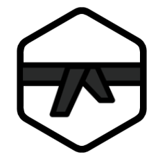
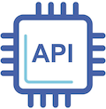
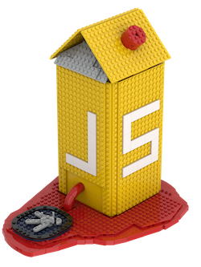

<!-- .slide: data-background="#FFFFFF" style="text-align: left; vertical-align: middle; color:white" color="#FFFFFF" -->
# Security by Meme<!-- .element style="color: #DB8831;" -->

## Less FUD, more FUN<!-- .element style="color: #DB8831;" -->

<!-- .element style="position: fixed; top: 300px; left: 60px; height: 200px;"  -->

<!-- .element style="vertical-align: middle; background:none; border:none; box-shadow:none; position: fixed; bottom: 80px; right: 20px; width: 440px" -->

-- Notes --

This is what to expect
* I'll feed you security lessons,
* disguised as some funny internet memes

--

## Topics

* Physical security
* Machine Learning & AI
* Code Quality
* Cryptography
* Password Security
* Bonus memes (if time)

-- Notes --

--

## whoami

<!-- .element style="position: fixed; top: 300px; left: 0px; height: 250px;"  -->

<!-- .element style="position: fixed; box-shadow:none; top: 134px; right: 78px; width: 206px;"  -->
<!-- .element style="position: fixed; box-shadow:none; top: 180px; right: 260px; height: 50px;"  -->
<!-- .element style="position: fixed; box-shadow:none; top: 180px; right: 208px; height: 50px;"  -->
<!-- .element style="position: fixed; box-shadow:none; top: 180px; right: 156px; height: 50px;"  -->
<!-- .element style="position: fixed; box-shadow:none; top: 180px; right: 104px; height: 50px;"  -->
<!-- .element style="position: fixed; box-shadow:none; top: 180px; right: 52px; height: 50px;"  -->
<!-- .element style="position: fixed; box-shadow:none; top: 232px; right: 260px; height: 50px;"  -->
<!-- .element style="position: fixed; box-shadow:none; top: 232px; right: 212px; height: 50px;"  -->
<!-- .element style="position: fixed; box-shadow:none; top: 232px; right: 156px; height: 50px;"  -->
<!-- .element style="position: fixed; box-shadow:none; top: 238px; right: 104px; width: 50px; "  -->
<!-- .element style="position: fixed; box-shadow:none; top: 232px; right: 52px; height: 50px;"  -->

DevSecOps<!-- .element style="font-size: 10px; position: fixed; top: 295px; right: 260px;" -->
Java<!-- .element style="font-size: 10px; position: fixed; top: 295px; right: 222px;" -->
API<!-- .element style="font-size: 10px; position: fixed; top: 295px; right: 176px;" -->
Docker<!-- .element style="font-size: 10px; position: fixed; width: 50px; top: 295px; right: 97px;" -->
WebApp Testing<!-- .element style="font-size: 10px; position: fixed; width: 50px; top: 295px; right: 46px;" -->

<!-- .element style="position: fixed; box-shadow:none; top: 370px; left: 520px; width: 140px;"  -->
<!-- .element style="position: fixed; box-shadow:none; top: 220px; left: 470px; width: 180px;"  -->
<!-- .element style="position: fixed; box-shadow:none; top: 530px; right: 320px; width: 140px;"  -->
<!-- .element style="position: fixed; box-shadow:none; top: 500px; left: 320px; width: 120px;"  -->
<!-- .element style="position: fixed; box-shadow:none; top: 434px; right: 60px; width: 120px;"  -->
<!-- .element style="position: fixed; box-shadow:none; top: 200px; left: 260px; width: 200px;"  -->
<!-- .element style="position: fixed; box-shadow:none; top: 350px; right: 40px; width: 180px;"  -->
<!-- .element style="position: fixed; box-shadow:none; top: 520px; right: 160px; width: 120px;"  -->
<!-- .element style="position: fixed; box-shadow:none; top: 534px; right: 20px; width: 110px;"  -->
<!-- .element style="position: fixed; box-shadow:none; top: 120px; left: 290px; width: 280px;"  -->

