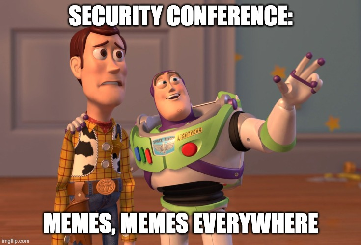

# Thank you

#### Please rate my talk

<!-- .element style="position: fixed; top: 200px; left: 20px; height: 200px;"  -->

<!-- .element style="position: fixed; top: 200px; right: 10px; height: 300px;"  -->

Questions:<!-- .element style="position: fixed; bottom: 135px; left: -15px;" -->
<!-- .element style="vertical-align: middle; background:none; border:none; box-shadow:none; width: 30px;" --> / <!-- .element style="vertical-align: middle; background:none; border:none; box-shadow:none; width: 30px;" --> brampatelski<!-- .element style="position: fixed; bottom: 125px; left: 120px;" -->

Slides:<!-- .element style="position: fixed; bottom: 100px; left: -15px;" -->
<!-- .element style="vertical-align: middle; background:none; border:none; box-shadow:none; width: 30px;" --> brampat.github.io<!-- .element style="position: fixed; bottom: 90px; left: 120px;" -->

<!-- .element style="position: fixed; bottom: 10px; right: 20px; border:none; box-shadow:none; width: 150px;" -->

-- Notes --

--

Empty slide
