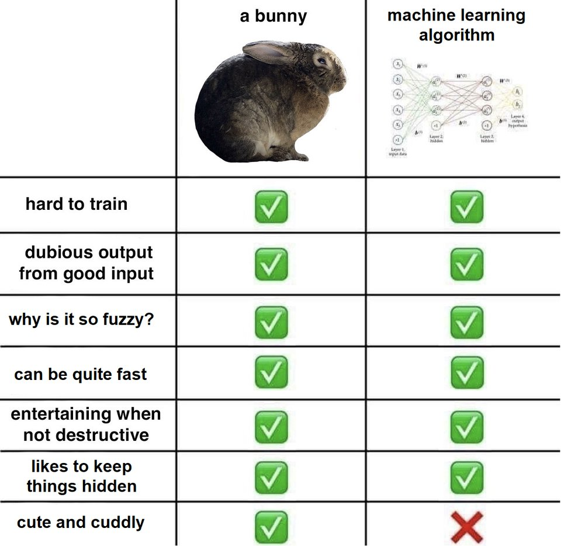

## Machine Learning, Deep Learning & AI

--

<!-- .element class="center-x" style="border:none; box-shadow:none; position: fixed; width: 650px; top: 10px;"  -->

-- Notes --

* Any Machine Learning experts here?
  * Machine learning is fuzzy logic right?
  * But it can be quite fast?
  * Is your algorithm cute & cuddly?
* What's the hardest thing about Machine Learning?
  * Is it the learning data-set?
  * Here's a nice data-set (next slide)

--

<!-- .element class="center-x" style="border:none; box-shadow:none; position: fixed; width: 650px; top: 10px;"  -->

-- Notes --

* Here's a really hard machine learning data-set
* While Google still needs our help with traffic lights, busses & boats, there are much harder Machine Learning sets to crack.
* Humans are still better at recognizing cakes from dogs
* But we're not always better at detecting things (next slide)

--

<!-- .element class="center-x" style="border:none; box-shadow:none; position: fixed; width: 400px; top: 10px;"  -->

-- Notes --

* Here's an example of things we find hard to spot
* which computers can doo much better and faster (Sonarqube, other SAST tools, SIEM)
* But we'll come back to coding bugs in a later slide

--

<!-- .element class="center-xy" style="background:none; border:none; box-shadow:none; position: fixed; width: 500px;" -->

--

## Should we worry?

<!-- .element class="center-xy" style="background:none; border:none; box-shadow:none; position: fixed; width: 500px;" -->

--

## Prompt injection

<!-- .element class="center-xy" style="background:none; border:none; box-shadow:none; position: fixed; width: 1397px;" -->

--

## Not when Obvious

<!-- .element class="center-x" style="background:none; border:none; box-shadow:none; position: fixed; bottom: 10px; width: 550px;" -->

-- Notes --

* Accept that AI makes mistakes and detect and correct these
* Sometimes those mistakes are obvious

--

## Or with manual labour (yet)

<!-- .element class="center-xy" style="background:none; border:none; box-shadow:none; position: fixed; width: 750px;" -->

-- Notes --

* 27 Quellinstraat, Antwerp, Flanders
* Some forms of manual labour are not AI jobs (yet)
* We already have 3D printed houses
* Over time, progress & development made manual labour easier:
  * Plow, workhorses, machinery

--

## Extrapolating data

<!-- .element class="center-x" style="background:none; border:none; box-shadow:none; position: fixed; bottom: 20px; width: 600px;" -->

-- Notes --

* Sometimes those mistakes are obvious
* Sometimes we can set boundaries to detect those mistakes

--

## TCAI: Total Cost of AI

<!-- .element class="center-x" style="background:none; border:none; box-shadow:none; position: fixed; bottom: 10px; width: 700px;" -->

-- Notes --

* And sometimes there are "hidden" costs

--

## RISKS

<!-- .element class="center-xy" style="border:none; box-shadow:none; position: fixed; width: 850px;" 
 -->

-- Notes --

* AI makes mistakes, always check, especially in high risk / high stakes systems:
  * Health care, military, machinery, self-driving vehicles 
* Artificial Intelligence should be implemented with care, to preserve human values
  * that's why we have Asimov's laws
* Again: the training data-set is very important
  * we should make sure we don't create biased algorithms
    * Examples: preferring caucasian ppl over ppl of color (Twitter)
    * Gender bias
    * Dutch Tax offices: groups are fraudulent based on religion, home address, car-size etc
  * Algorithms are only as fair as the people who create them and the data-sets we train them with

