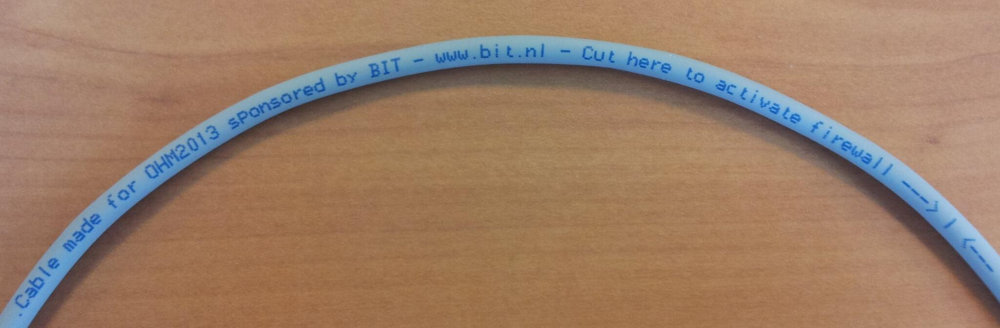
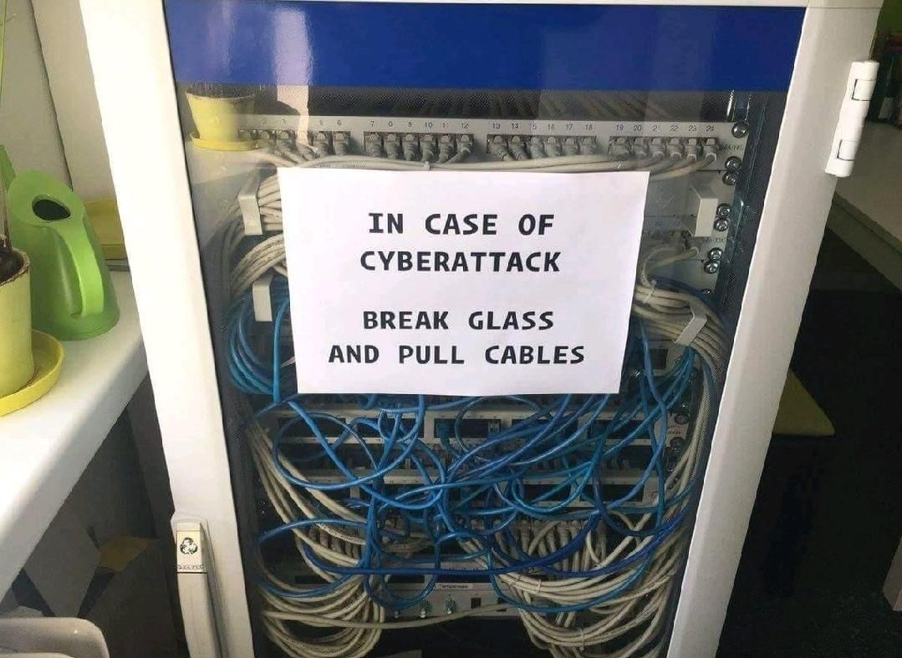

## Bonus memes

--

## Cut here to activate firewall

<!-- .element style="border:none; box-shadow:none; position: fixed; width: 850px; left: 0px; top: 210px;"  -->

-- Notes --

There is an actual Dutch datacenter (Bit.nl) that uses these cables

--

<!-- .element style="border:none; box-shadow:none; position: fixed; width: 750px; right: 0px; bottom: 60px;"  -->

-- Notes --

This is great advice:
* when attacked, close all network connections
* Probably WiFi -> software-setting
* This was the advice in MediaMarkt ransomware attack in Nov 2021

