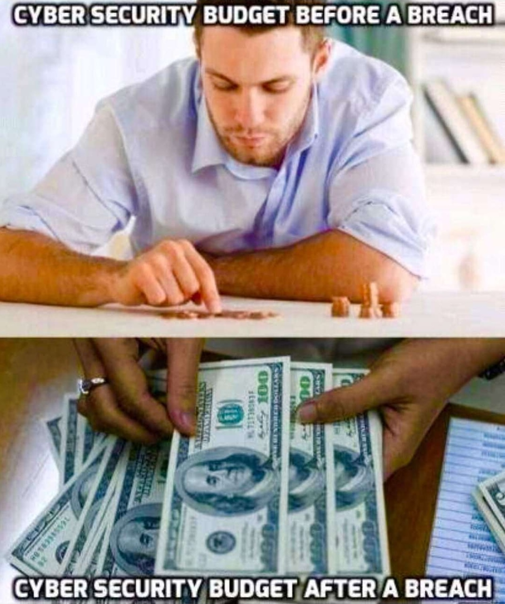
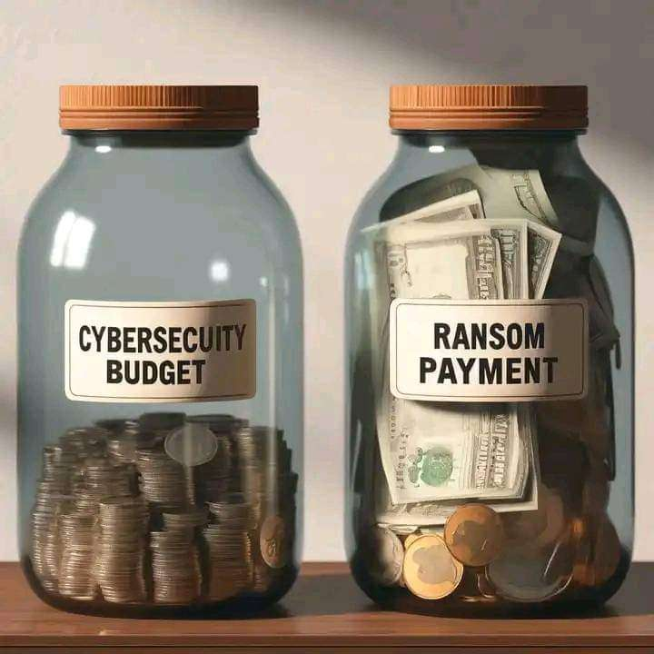
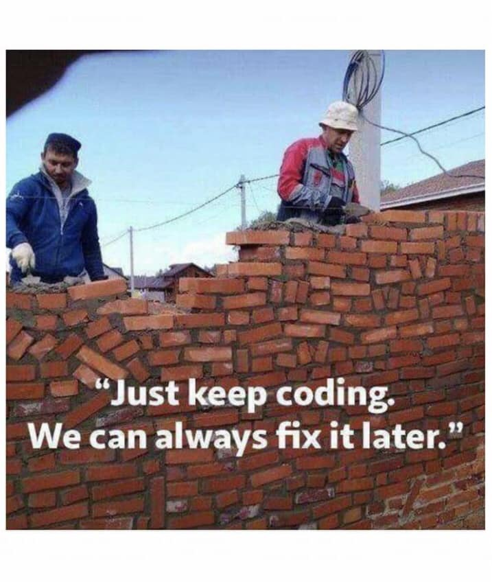

## Requirements & Budget

--

<!-- .element class="center-xy" style="border:none; box-shadow:none; position: fixed; width: 510px; height: 600px;"  -->

-- Notes --

What you get when you cut on budget

--

<!-- .element class="center-xy" style="border:none; box-shadow:none; position: fixed; width: 540px; height: 666px;"  -->

-- Notes --

Be prepared.
* Security is not a cost with clear return on investment.
* Security is an insurance for something you hope never happens
* Might feel like spent money with no benefit
* PR damage is hard to put a number on

--

<!-- .element class="center-xy" style="border:none; box-shadow:none; position: fixed; width: 540px; height: 666px;"  -->

-- Notes --

* Because if you're not, you'll spend much more on ransomware payments

--

<!-- .element class="center-xy" style="border:none; box-shadow:none; position: fixed; width: 550px; height: 650px; "  -->

-- Notes --

It's never too early to start with Security
* See design: Security Gate that's also a ladder
