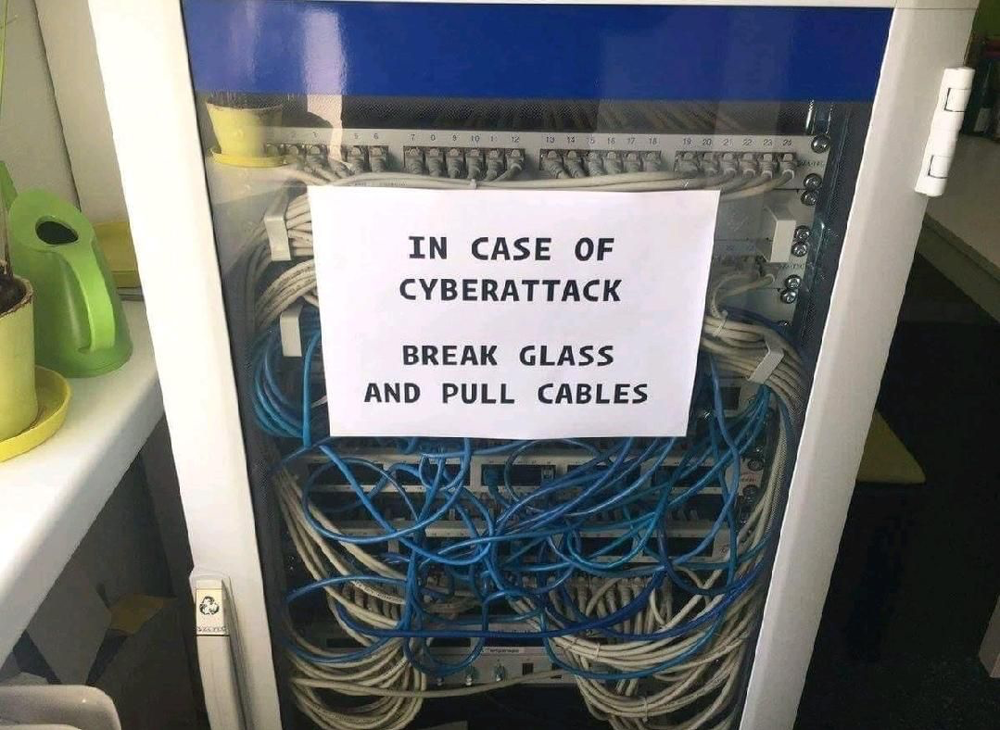

## Operations

<!-- .element class="center-y" style="border:none; box-shadow:none; position: fixed; width: 480px; height: 600px; right: 0px"  -->

--

<!-- .element class="center-x" style="border:none; box-shadow:none; position: fixed; width: 460px; height: 650px; top: 10px;"  -->

--

## Cut here to activate firewall

<!-- .element class="center-x" style="border:none; box-shadow:none; position: fixed; width: 850px; top: 210px;"  -->

-- Notes --

There is an actual Dutch datacenter (Bit.nl) that uses these cables

--

<!-- .element class="center-xy" style="border:none; box-shadow:none; position: fixed; width: 750px;"  -->

-- Notes --

This is great advice:
* when attacked, close all network connections
* Probably WiFi -> software-setting
* This was the advice in MediaMarkt ransomware attack in Nov 2021

--

<!-- .element class="center-x" style="border:none; box-shadow:none; position: fixed; width: 493px; height: 650px; top: 10px;" -->

--

<!-- .element class="center-xy" style="border:none; box-shadow:none; position: fixed; width: 600px; height: 450px;" -->

--

<!-- .element class="center-xy" style="border:none; box-shadow:none; position: fixed; width: 592px; height: 450px;"  -->

--

<!-- .element class="center-x" style="border:none; box-shadow:none; position: fixed; width: 473px; height: 650px; top: 10px;"  -->

--

<!-- .element class="center-x" style="border:none; box-shadow:none; position: fixed; width: 634px; height: 650px; top: 10px;"  -->

--

<!-- .element style="border:none; box-shadow:none; position: fixed; width: 600px; left: 200px; bottom: 20px;"  -->

--

<!-- .element class="center-xy" style="border:none; box-shadow:none; position: fixed; width: 532px; height: 436px;"  -->

--

<!-- .element class="center-x" style="border:none; box-shadow:none; position: fixed; width: 799px; height: 618px; top: 10px;"  -->

--

<!-- .element class="center-xy" style="border:none; box-shadow:none; position: fixed; width: 422px; height: 585px;"  -->

--

<!-- .element class="center-xy" style="border:none; box-shadow:none; position: fixed; width: 632px; height: 394px;"  -->

--

<!-- .element class="center-xy" style="border:none; box-shadow:none; position: fixed; width: 747px; height: 499px;"  -->

--

<!-- .element class="center-xy" style="border:none; box-shadow:none; position: fixed; width: 612px; height: 408px;"  -->

--

<!-- .element class="center-x" style="border:none; box-shadow:none; position: fixed; width: 630px; height: 650px; top: 10px;"  -->

