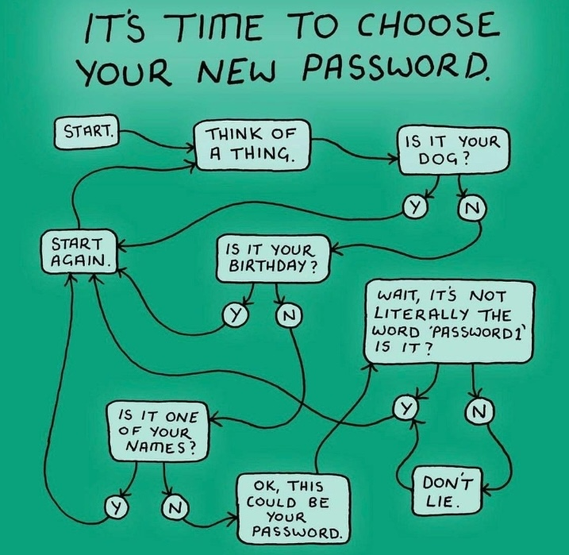

## Password Security

### Why? (boring)

<!-- .element style="position: fixed; width: 250px; bottom: 180px; right: 20px;" -->
MFA bomb

<!-- .element style="border:none; box-shadow:none; position: fixed; width: 250px; top: 120px; right: 20px;" -->
solarwinds123

<!-- .element style="border:none; box-shadow:none; position: fixed; width: 250px; bottom: 220px; right: 450px;" -->
Stolen credentials

<!-- .element style="position: fixed; width: 220px; bottom: 30px; right: 220px;" -->
Reused PW's

<!-- .element style="border:none; box-shadow:none; position: fixed; width: 200px; top: 100px; right: 410px;" -->
MFA Bypass

<!-- .element style="position: fixed; width: 250px; bottom: 120px; left: 0px;" class="fragment" data-fragment-index="0" -->
Ep 33: RockYou
Ep 45: Xbox Underground

-- Notes --

* 80% + of breaches are password related
* Uber: Social Engineering for passwords plus MFA request bomb
* Solarwinds: solarwinds123
* MediBank: Obtained Stolen credentials. 4M customer data stolen
* [Crypto.com](https://www.vice.com/en/article/g5qj9j/cryptocom-says-incident-was-actually-dollar30-million-hack): 2FA bypass
* XBox: Reused PW's from RockYou hack
* Deepdive: Darknet Diaries ep. 45

--

<!-- .element class="center-x" style="border:none; box-shadow:none; position: fixed; width: 850px; top: 10px;"  -->

Username:<!-- .element style="font-size: 50px; box-shadow:none; position: fixed; bottom: 110px; left: 20px;" -->
Forrest_Gump<!-- .element style="font-size: 50px; box-shadow:none; position: fixed; bottom: 110px; left: 400px;" class="fragment" data-fragment-index="1" -->
Password:<!-- .element style="font-size: 50px; box-shadow:none; position: fixed; bottom: 50px; left: 20px;" -->
1Forrest1<!-- .element style="font-size: 50px; box-shadow:none; position: fixed; bottom: 50px; left: 400px;" class="fragment" data-fragment-index="2" -->

-- Notes --

Let's first talk about predictable passwords:
* Bad pun:
  * What's Forrest Gump's password?
  * Hint: first-name
  * Hint 2: famous quote with his first-name
* Why is this a bad password?
  * It's predictable

--

## Long
## Unique
## Random
## Passwords

<!-- .element style="position: fixed; width: 550px; top: 30px; right: 0px;" -->

(*) L.A.R.P. = Live Action Role Playing
<!-- .element style="position: fixed; width: 150px; bottom: 50px; left: 0px;" class="fragment" data-fragment-index="0" -->

-- Notes --

How to make passwords unpredictable:
* LURP
* Not LARP what these guys are doing
How do you do that?
* Password Manager

--

## Long

<!-- .element class="center-x" style="border:none; box-shadow:none; position: fixed; width: 650px; bottom: 60px;"  -->

-- Notes --

Why Long:
* Longer passwords means harder to crack
* Length beats complexity in general
* Whenever you try to use 50+ character passwords

--

## Unique

<!-- .element class="center-x" style="border:none; box-shadow:none; position: fixed; width: 550px; top: 10px;"  -->
<!-- .element class="center-x fragment" style="border:none; box-shadow:none; position: fixed; width: 550px; bottom: 20px;" -->

-- Notes --

Why unique:
* If it's reused, it will leak
* If someone asks for your password, you say no
* But any random website, we have no problem to provide our password
* Earliest password leak 1962 at MIT

--

## Unique

<!-- .element style="border:none; box-shadow:none; position: fixed; width: 750px; top: 100px; left: 100px;"  -->
<!-- .element style="border:none; box-shadow:none; position: fixed; width: 520px; top: 135px; left: 176px;" class="fragment" data-fragment-index="1" -->

-- Notes --

Effect of password reuse is:
* Armor is Millions of dollars on Cyber-security will fail
* Arrow through the visor: when people reuse passwords
* You are part of security, if you like it or not
* So get a password manager

--

## Random

<!-- .element class="center-x" style="border:none; box-shadow:none; position: fixed; width: 650px; bottom: 10px;"  -->

-- Notes --

* admin / admin is the oldest vulnerability in existence and is still not fixed
  * Earliest occurence is [CVE-1999-0503](https://nvd.nist.gov/vuln/detail/CVE-1999-0503) registered in Oct. 1998
* Make it random

--

## Now what?

<!-- .element style="border:none; box-shadow:none; position: fixed; width: 540px; right: 50px; top: 0px;" -->

-- Notes --

So now what?
* Change your weak passwords of course and make them LURP

--

<!-- .element class="center-x" style="border:none; box-shadow:none; position: fixed; width: 630px;" bottom: 20px; -->

-- Notes --

* So how DO we choose a strong, effective password?

--

<!-- .element class="center-xy" style="border:none; box-shadow:none; position: fixed; width: 650px;"  -->

-- Notes --

More stupid rules:
* mandatory password rotation, which completely defeats its purpose

--

## Dutch MKB Tax site

<!-- .element style="border:none; box-shadow:none; position: fixed; width: 550px; left: 0px; top: 100px;"  -->
<!-- .element style="border:none; box-shadow:none; position: fixed; width: 450px; right: 0px;" class="fragment" data-fragment-index="6"  -->

P<!-- .element style="font-size: 50px; box-shadow:none; position: fixed; bottom: 150px; right: 205px;" class="fragment" data-fragment-index="1" -->
@<!-- .element style="font-size: 50px; box-shadow:none; position: fixed; bottom: 150px; right: 165px;" class="fragment" data-fragment-index="4" -->
ss<!-- .element style="font-size: 50px; box-shadow:none; position: fixed; bottom: 150px; right: 125px;" class="fragment" data-fragment-index="2" -->
w<!-- .element style="font-size: 50px; box-shadow:none; position: fixed; bottom: 150px; right: 90px;" class="fragment" data-fragment-index="2" -->
0<!-- .element style="font-size: 50px; box-shadow:none; position: fixed; bottom: 150px; right: 65px;" class="fragment" data-fragment-index="3" -->
r<!-- .element style="font-size: 50px; box-shadow:none; position: fixed; bottom: 150px; right: 45px;" class="fragment" data-fragment-index="2" -->
d<!-- .element style="font-size: 50px; box-shadow:none; position: fixed; bottom: 150px; right: 15px;" class="fragment" data-fragment-index="2" -->
<!-- .element style="box-shadow:none; position: fixed; width: 15px; top: 370px; left: 420px;" class="fragment" data-fragment-index="1" -->
<!-- .element style="box-shadow:none; position: fixed; width: 15px; top: 385px; left: 420px;" class="fragment" data-fragment-index="2" -->
<!-- .element style="box-shadow:none; position: fixed; width: 15px; top: 400px; left: 420px;" class="fragment" data-fragment-index="3" -->
<!-- .element style="box-shadow:none; position: fixed; width: 15px; top: 490px; left: 420px;" class="fragment" data-fragment-index="4" -->
<!-- .element style="box-shadow:none; position: fixed; width: 15px; top: 300px; left: 420px;" class="fragment" data-fragment-index="5" -->
<!-- .element style="box-shadow:none; position: fixed; width: 15px; top: 330px; left: 420px;" class="fragment" data-fragment-index="5" -->
<!-- .element style="box-shadow:none; position: fixed; width: 15px; top: 355px; left: 420px;" class="fragment" data-fragment-index="5" -->
<!-- .element style="box-shadow:none; position: fixed; width: 15px; top: 430px; left: 420px;" class="fragment" data-fragment-index="5" -->
<!-- .element style="box-shadow:none; position: fixed; width: 15px; top: 445px; left: 420px;" class="fragment" data-fragment-index="5" -->

1Forrest1<!-- .element style="font-size: 30px; box-shadow:none; position: fixed; bottom: 55px; right: 65px;" class="fragment" data-fragment-index="7" -->
<!-- .element style="box-shadow:none; position: fixed; width: 25px; bottom: 50px; right: 40px;" class="fragment" data-fragment-index="7" -->

-- Notes --

Anyone from Tax:
* If this has changed, please let me know so I can change slides

Lets choose a password that checks all the boxes:
* 1 Uppercase
* 5 lowercase
* A Number
* Bonus: Symbol
* Rest also fits:
    * Length 8+
    * No more than 3 of the same characters
    * No more than 3 Symbol marks
    * Only symbols from this list
* Note: 1Forrest1 also allowed

--

## Compliant vs Secure

<!-- .element style="border:none; box-shadow:none; position: fixed; width: 750px; left: 100px; bottom: 100px;"  -->

-- Notes --

* There is a difference between password compliant and secure
* It's all about predictable

--

<!-- .element class="center-xy" style="border:none; box-shadow:none; position: fixed; width: 550px;"  -->

-- Notes --

* Here's an idea (thanks to emoticons in UTF-8)
  * The snow glows white on the mountain tonight
  * Not a footprint to be seen.
  * A kingdom of isolation,
  * and it looks like I'm the Queen
  * The wind is howling like this swirling storm inside
  * Couldn't keep it in;
  * Heaven knows I've tried
* Well, it should be long, unique and random
* But not to complex, so you can't even type it in
* This is:
  * "Let it go" in emoticons (from Frozen)
  * Someone used this on the password-change screen
  * Noticed there's no emoticons keyboard on the login-screen

--

## Memorize (?)

<!-- .element style="border:none; box-shadow:none; position: fixed; width: 650px; right: 0px; top: 0px;"  -->

-- Notes --

* But how can you remember all those passwords?

--

## Written down (?)

<!-- .element style="border:none; box-shadow:none; position: fixed; width: 750px; left: 50px;"  -->

-- Notes --

* You could write them down
* And to be honest, that's not even that bad.
  * Hence Password-notebooks
  * Yes, these are easily stolen or lost
  * But the risk of password notebooks being stolen is way less than 
  * reused passwords in a data breach
  * Just guard them with your life and have a recovery and incident response plan.

--

## Lesson

<!-- .element style="border:none; box-shadow:none; position: fixed; width: 750px; left: 100px;"  -->

<!-- .element style="position: fixed; width: 150px; bottom: 50px; left: 0px;" class="fragment" data-fragment-index="0" -->

-- Notes --

But the best method is simply using password managers
* MFA where possible

