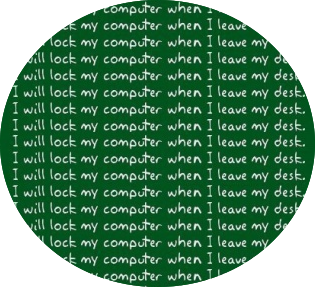

## Physical Security

### Why?

<!-- .element style="border:none; box-shadow:none; position: fixed; width: 800px; right: 0px; bottom: 90px;"  -->
<!-- .element style="border:none; box-shadow:none; position: fixed; width: 450px; right: -50px; top: 0px;"  -->

More inspiration: [40 tips](https://www.troyhunt.com/40-inappropriate-actions-to-take/) from Troy Hunt (2013)<!-- .element style="font-size: 15px; box-shadow:none; position: fixed; bottom: 60px; left: 10px; width: 200px;" -->

-- Notes --

* Desktop backgrounds like this
  * There are so many fun things to do with unlocked & unattended PCs & laptops
  * Prepare your team-mates first
  * Teach your colleagues to always lock
* Uninvited visitors could still visit
* Physical access can lead to digital access

--

## Also why

<!-- .element style="border:none; box-shadow:none; position: fixed; width: 800px; right: 0px; bottom: 40px;"  -->

--

<!-- .element class="center-xy" style="border:none; box-shadow:none; position: fixed; width: 650px; "  -->

-- Notes --

OWASP A09: Security Logging & Monitoring
OWASP C9: Implement Security Logging and Monitoring

* Don't blame people when they fail on Security
  * Help and educate instead
  * See how you can improve on teaching
  * Reward ppl for doing the right thing
* We all have company badges:
  * All employees can check for badges, when company policy is to wear them visibly
  * Be helpful and friendly, malicious ppl will reveal themselves soon enough
  * Spot that "lost visitor" and help them to front-desk for a visitor badge

--

<!-- .element style="border:none; box-shadow:none; position: fixed; width: 550px; right: 70px; top: 5px;"  -->

-- Notes --

OWASP A04: Insecure Design
OWASP A06: Vulnerable & Outdated components

* Secure Design is important
  * Perform Secure design review
* This is true with software development as well
  * Think about how your system is going to be used
  * Think how it can be abused
  * Design accordingly
  * Threat modelling
  * Architecture Validation

OWASP SAMM - Design - Security Architecture - ML2: Secure by default design
OWASP SAMM - Design - Security Architecture - Architecture Design ML3: 
* Improve reference architectures based on insights and best practices
OWASP SAMM - Verification - Architecture Assessment - Architecture Validation ML3: 
* Review of the architecture components' effectiveness

--

<!-- .element style="border:none; box-shadow:none; position: fixed; width: 750px; right: 50px; top: 10px;"  -->

-- Notes --

OWASP A01: Broken Access Control
OWASP C07: Enforce Access Controls

Threat model to prevent authorization bypasses

