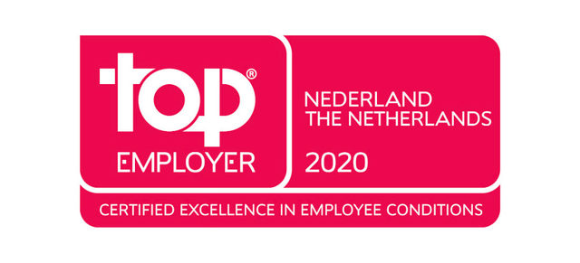
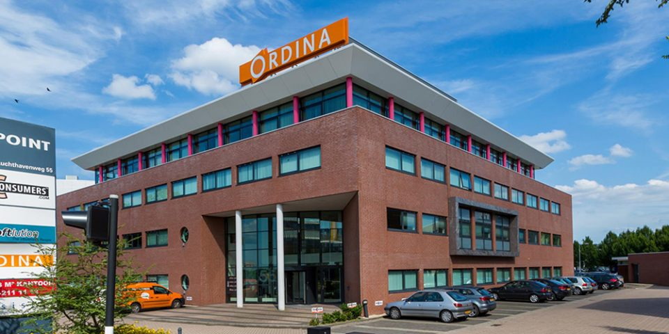

<!-- .slide: style="text-align: left; vertical-align: middle; color:white" color="#FFFFFF" -->

# Ordina

## In het kort

<!--  .element style="position: fixed; box-shadow:none; bottom: 340px; right: 20px; width: 300px; " -->
<!--  .element style="position: fixed; box-shadow:none; bottom: 10px; left: 20px; width: 600px; " -->
<!--  .element style="position: fixed; box-shadow:none; bottom: 250px; left: 620px; width: 100px; " -->
<!--  .element style="position: fixed; box-shadow:none; bottom: 300px; left: 320px; width: 100px; " -->
<!--  .element style="position: fixed; box-shadow:none; bottom: 160px; left: 520px; width: 100px; " -->
<!--  .element style="position: fixed; box-shadow:none; bottom: 140px; left: 220px; width: 100px; " -->
<!--  .element style="position: fixed; box-shadow:none; bottom: 380px; left: 460px; width: 100px; " -->
<!--  .element style="position: fixed; box-shadow:none; bottom: 140px; left: 680px; width: 100px; " -->
<!--  .element style="position: fixed; box-shadow:none; bottom: 20px; left: 650px; width: 100px; " -->
<!--  .element style="position: fixed; box-shadow:none; bottom: 140px; left: 360px; width: 100px; " -->
<!--  .element style="position: fixed; box-shadow:none; bottom: 40px; left: 780px; width: 100px; " -->
<!--  .element style="position: fixed; box-shadow:none; bottom: 280px; left: 20px; width: 100px; " -->
<!--  .element style="position: fixed; box-shadow:none; bottom: 180px; left: 790px; width: 100px; " -->
<!--  .element style="position: fixed; box-shadow:none; bottom: 300px; left: 180px; width: 100px; " -->
<!--  .element style="position: fixed; box-shadow:none; bottom: 120px; left: 40px; width: 100px; " -->

--

# Ordina

## Thema's

<!--                   .element style="position: fixed; box-shadow:none; bottom: 280px; left: 20px; width: 100px; " -->
<!--   .element style="position: fixed; box-shadow:none; bottom: 280px; left: 220px; width: 100px; " -->
<!--                    .element style="position: fixed; box-shadow:none; bottom: 280px; left: 420px; width: 100px; " -->
<!--                      .element style="position: fixed; box-shadow:none; bottom: 280px; left: 620px; width: 100px; " -->
<!--                        .element style="position: fixed; box-shadow:none; bottom: 280px; left: 820px; width: 100px; " -->

High Performance Teams<!--                    .element style="position: fixed; box-shadow:none; top: 420px; left: 20px; width: 100px; font-size: 20px;" -->
Intelligente Datagedreven Organisaties<!--    .element style="position: fixed; box-shadow:none; top: 420px; left: 220px; width: 100px; font-size: 20px;" -->
Digitale Acceleratie<!--                      .element style="position: fixed; box-shadow:none; top: 420px; left: 420px; width: 100px; font-size: 20px;" -->
Business Platforms<!--                        .element style="position: fixed; box-shadow:none; top: 420px; left: 620px; width: 100px; font-size: 20px;" -->
Cybersecurity & Compliance<!--                .element style="position: fixed; box-shadow:none; top: 420px; left: 820px; width: 140px; font-size: 20px;" -->

<!-- .element style="position: fixed; box-shadow:none; bottom: 10px; right: 20px; width: 150px;" -->

-- Notes --

* High Performance Teams
  * Scrum teams
  * digitale oplossingen
  * kwaliteit IT-toepassingen optimaliseren
* Intelligente Datagedreven Organisaties
  * bigdata achter innovatie en onderscheidend vermogen
  * kracht data slim benutten
  * BigData
  * Inzicht middels dashboards
  * Sturen obv. data en statistieken
* Digitale Acceleratie
  * slim transformeren om te versnellen
  * business- en de technologiekant, maar ook wat dit betekent op menselijk vlak
  * VR / AR
* Business Platforms
  * Business platforms (Maatwerk of standaard):
    * Versimpelen
    * Integreren middels API's
    * Innoveren en koppelen met nieuwe technologie
      * Cloud
      * IOT
      * AI
* Cybersecurity & Compliance
  * verhogen de veiligheid en weerbaarheid middels TOP
  * Techniek: IT-landschap en netwerken
    * Incident response
    * Pentesting
  * Organisatie: governance, risk & compliance
    * 
  * Persoon: awareness * training

--

# Ordina

| Units                         |  Brands                                                                                       |
|-------------------------------|-----------------------------------------------------------------------------------------------|
| OSD                           | JTech, JS Roots, MTech, ZTech, Pythoneers, Auto-Q       |
| Business Platforms            | STACK-C, Digital Services, JDE, Oracle, SAP, SCO, Rules Matter, Maatwerk       |
| Digital                       | Clockwork                                               |
| Data-driven                   | Data Science, GEO ICT, Visionworks                      |
| Consulting                    | Architecture, Business Consulting, Leadership, Requirements       |
| Cybersecurity & Compliance    | Red Team, Blue Team, Strategy                           |
| Talentpower                   |                                                         |

--

# Ordina

## Locaties

* Nieuwegein
* Groningen
* Eindhoven
* Amsterdam
* Belgie: Mechelen, Gent, Lummen
* Luxemburg: Windhof

<!-- .element style="position: fixed; box-shadow:none; top: 160px; right: 20px; width: 250px;" -->
<!-- .element style="position: fixed; box-shadow:none; top: 160px; right: 280px; width: 250px;" -->
<!-- .element style="position: fixed; box-shadow:none; top: 295px; right: 20px; width: 250px;" -->
<!-- .element style="position: fixed; box-shadow:none; top: 295px; right: 280px; width: 250px;" -->

