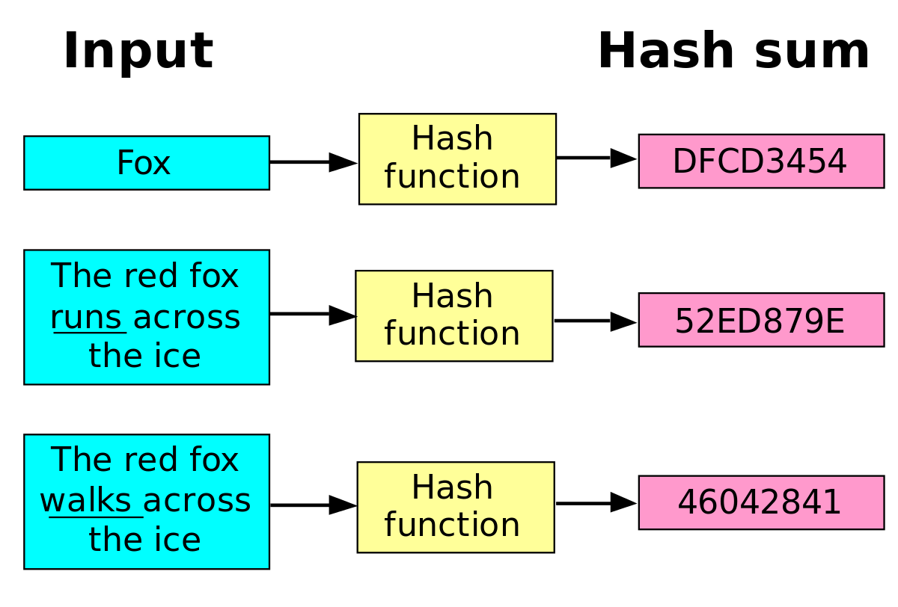

## Password hacking
<hr />

* Why __strong__ passwords?
* How __strong__ should they be?
* What can I as a __user__ do?
* What can I as a __developer__ do?

<!-- .element style="box-shadow:none; position: fixed; width: 500px; bottom: 20px; right: 10px;" -->

-- Notes --

The way we failed at effective passwords is so prevalent, there is an XKCD comic about it.

--

## Why?
<hr />

<!-- .element style="position: fixed; width: 450px; top: 150px; left: 0px;"  -->
<!-- .element style="position: fixed; width: 500px; top: 150px; right: 0px;" class="fragment" data-fragment-index="1" -->


--

## SQL Injection Attack
<hr />

<!-- .element style="box-shadow:none; position: fixed; left: 120px; top: 250px;" -->
<pre>admin</pre><!-- .element style="box-shadow:none; position: fixed; left: 115px; top: 310px; width: 100px;" -->
<!-- .element style="box-shadow:none; position: fixed; left: 70px; top: 330px;" -->
<pre>alice</pre><!-- .element style="box-shadow:none; position: fixed; left: 65px; top: 390px; width: 100px;" -->
<!-- .element style="box-shadow:none; position: fixed; left: 70px; top: 410px;" -->
<pre>bob</pre><!-- .element style="box-shadow:none; position: fixed; left: 70px; top: 470px; width: 100px;" -->
<!-- .element style="box-shadow:none; position: fixed; left: 120px; top: 470px;" -->
<pre>eve</pre><!-- .element style="box-shadow:none; position: fixed; left: 120px; top: 530px; width: 100px;" -->


<!-- .element style="box-shadow:none; position: fixed; left: 320px; top: 300px;" -->

<!-- .element style="box-shadow:none; position: fixed; left: 140px; top: 280px;" class="fragment" data-fragment-index="0" -->
<!-- .element style="box-shadow:none; position: fixed; left: 90px; top: 360px;" class="fragment" data-fragment-index="0" -->
<!-- .element style="box-shadow:none; position: fixed; left: 90px; top: 400px;" class="fragment" data-fragment-index="0" -->
<!-- .element style="box-shadow:none; position: fixed; left: 140px; top: 445px;" class="fragment" data-fragment-index="0" -->

<pre>P@ssw0rd</pre><!-- .element style="box-shadow:none; position: fixed; left: 240px; top: 360px; width: 100px;" class="fragment" data-fragment-index="0" -->
<pre>qwerty</pre><!-- .element style="box-shadow:none; position: fixed; left: 240px; top: 385px; width: 100px;" class="fragment" data-fragment-index="0" -->
<pre>123456</pre><!-- .element style="box-shadow:none; position: fixed; left: 240px; top: 410px; width: 100px;" class="fragment" data-fragment-index="0" -->
<pre>password</pre><!-- .element style="box-shadow:none; position: fixed; left: 240px; top: 435px; width: 100px;" class="fragment" data-fragment-index="0" -->

<pre>admin</pre><!-- .element style="box-shadow:none; position: fixed; left: 365px; top: 405px; width: 100px; height: 100px;" class="fragment" data-fragment-index="0" -->
<pre>alice</pre><!-- .element style="box-shadow:none; position: fixed; left: 365px; top: 430px; width: 100px; height: 100px;" class="fragment" data-fragment-index="0" -->
<pre>bob</pre><!-- .element style="box-shadow:none; position: fixed; left: 365px; top: 455px; width: 100px; height: 100px;" class="fragment" data-fragment-index="0" -->
<pre>eve</pre><!-- .element style="box-shadow:none; position: fixed; left: 365px; top: 480px; width: 100px; height: 100px;" class="fragment" data-fragment-index="0" -->

<pre>P@ssw0rd</pre><!-- .element style="box-shadow:none; position: fixed; left: 420px; top: 405px; width: 100px; height: 100px;" class="fragment" data-fragment-index="0" -->
<pre>qwerty</pre><!-- .element style="box-shadow:none; position: fixed; left: 420px; top: 430px; width: 100px; height: 100px;" class="fragment" data-fragment-index="0" -->
<pre>123456</pre><!-- .element style="box-shadow:none; position: fixed; left: 420px; top: 455px; width: 100px; height: 100px;" class="fragment" data-fragment-index="0" -->
<pre>password</pre><!-- .element style="box-shadow:none; position: fixed; left: 420px; top: 480px; width: 100px; height: 100px;" class="fragment" data-fragment-index="0" -->

<!-- .element style="box-shadow:none; position: fixed; left: 580px; top: 400px;" class="fragment" data-fragment-index="1" -->
<pre>union select user, password 
from users; --</pre><!-- .element style="box-shadow:none; position: fixed; left: 580px; top: 460px;" class="fragment" data-fragment-index="1" -->


<!-- .element style="box-shadow:none; position: fixed; left: 750px; top: 300px;" class="fragment" data-fragment-index="3" -->
<pre>admin</pre><!-- .element style="box-shadow:none; position: fixed; left: 760px; top: 334px; width: 100px; height: 100px;" class="fragment" data-fragment-index="3" -->
<pre>alice</pre><!-- .element style="box-shadow:none; position: fixed; left: 760px; top: 365px; width: 100px; height: 100px;" class="fragment" data-fragment-index="3" -->
<pre>bob</pre><!-- .element style="box-shadow:none; position: fixed; left: 760px; top: 396px; width: 100px; height: 100px;" class="fragment" data-fragment-index="3" -->
<pre>eve</pre><!-- .element style="box-shadow:none; position: fixed; left: 760px; top: 427px; width: 100px; height: 100px;" class="fragment" data-fragment-index="3" -->
<pre>P@ssw0rd</pre><!-- .element style="box-shadow:none; position: fixed; left: 815px; top: 334px; width: 100px; height: 100px;" class="fragment" data-fragment-index="3" -->
<pre>qwerty</pre><!-- .element style="box-shadow:none; position: fixed; left: 815px; top: 365px; width: 100px; height: 100px;" class="fragment" data-fragment-index="3" -->
<pre>123456</pre><!-- .element style="box-shadow:none; position: fixed; left: 815px; top: 396px; width: 100px; height: 100px;" class="fragment" data-fragment-index="3" -->
<pre>password</pre><!-- .element style="box-shadow:none; position: fixed; left: 815px; top: 427px; width: 100px; height: 100px;" class="fragment" data-fragment-index="3" -->


-- Notes --

How can I extract all user-data using SQLi?
```Union select```
(or tools like SQLmap)

--

## Hashing TL;DR:
<hr />

See cryptography

<!-- .element style="box-shadow:none; width: 600px; " -->

-- Notes --

* One-way function
* Any size input results in fixed-size digest
* The same input always results in the same output
* Slightly different input results in completely different output
* In practice, different inputs never result in the same output

--


## SQL Injection Attack
<hr />

<!-- .element style="box-shadow:none; position: fixed; left: 120px; top: 300px;" -->


<pre>admin</pre><!-- .element style="box-shadow:none; position: fixed; left: 165px; top: 405px; width: 100px; height: 100px;" -->
<pre>alice</pre><!-- .element style="box-shadow:none; position: fixed; left: 165px; top: 430px; width: 100px; height: 100px;" -->
<pre>bob</pre><!-- .element style="box-shadow:none; position: fixed; left: 165px; top: 455px; width: 100px; height: 100px;" -->
<pre>eve</pre><!-- .element style="box-shadow:none; position: fixed; left: 165px; top: 480px; width: 100px; height: 100px;" -->

<pre>65E84...C5</pre><!-- .element style="box-shadow:none; position: fixed; left: 220px; top: 405px; width: 100px; height: 100px;" -->
<pre>8D969...92</pre><!-- .element style="box-shadow:none; position: fixed; left: 220px; top: 430px; width: 100px; height: 100px;" -->
<pre>5E884...D8</pre><!-- .element style="box-shadow:none; position: fixed; left: 220px; top: 455px; width: 100px; height: 100px;" -->
<pre>B03DD...42</pre><!-- .element style="box-shadow:none; position: fixed; left: 220px; top: 480px; width: 100px; height: 100px;" -->


<!-- .element style="box-shadow:none; position: fixed; left: 380px; top: 400px;" -->


<!-- .element style="box-shadow:none; position: fixed; left: 550px; top: 350px;" -->
<pre>admin</pre><!-- .element style="box-shadow:none; position: fixed; left: 560px; top: 384px; width: 100px; height: 100px;" -->
<pre>alice</pre><!-- .element style="box-shadow:none; position: fixed; left: 560px; top: 415px; width: 100px; height: 100px;" -->
<pre>bob</pre><!-- .element style="box-shadow:none; position: fixed; left: 560px; top: 446px; width: 100px; height: 100px;" -->
<pre>eve</pre><!-- .element style="box-shadow:none; position: fixed; left: 560px; top: 477px; width: 100px; height: 100px;" -->
<pre>65E84...C5</pre><!-- .element style="box-shadow:none; position: fixed; left: 615px; top: 384px; width: 100px; height: 100px;" -->
<pre>8D969...92</pre><!-- .element style="box-shadow:none; position: fixed; left: 615px; top: 415px; width: 100px; height: 100px;" -->
<pre>5E884...D8</pre><!-- .element style="box-shadow:none; position: fixed; left: 615px; top: 446px; width: 100px; height: 100px;" -->
<pre>B03DD...42</pre><!-- .element style="box-shadow:none; position: fixed; left: 615px; top: 477px; width: 100px; height: 100px;" -->

-- Notes --

How can I extract all user-data using SQLi?
```Union select```
(or tools like SQLmap)

--


## Offline Attacks
<hr />

### Hashcat

<pre>aaaaaaaa
aaaaaaab
.....
bbbbbbbb
cccccccc</pre><!-- .element style="box-shadow:none; position: fixed; left: 20px; top: 284px; width: 100px; height: 100px;" class="fragment" data-fragment-index="0"-->
<!-- .element style="box-shadow:none; position: fixed; left: 100px; top: 320px; -webkit-transform: rotate(-20deg);" class="fragment" data-fragment-index="0"-->


<!-- .element style="box-shadow:none; position: fixed; left: 220px; top: 250px; width: 200px;" -->

<!-- .element style="box-shadow:none; position: fixed; left: 270px; top: 270px;" -->

<!-- .element style="box-shadow:none; position: fixed; left: 420px; top: 320px; -webkit-transform: rotate(-60deg);" class="fragment" data-fragment-index="0"-->

<pre>1F3CE...B4
4E9BB...F1
.....
FB398...06
9FA10...22</pre><!-- .element style="box-shadow:none; position: fixed; left: 520px; top: 300px; width: 100px; height: 100px;" class="fragment" data-fragment-index="0"-->


<!-- .element style="box-shadow:none; position: fixed; left: 740px; top: 300px;" -->
<pre>admin</pre><!-- .element style="box-shadow:none; position: fixed; left: 750px; top: 334px; width: 100px; height: 100px;" -->
<pre>alice</pre><!-- .element style="box-shadow:none; position: fixed; left: 750px; top: 365px; width: 100px; height: 100px;" -->
<pre>bob</pre><!-- .element style="box-shadow:none; position: fixed; left: 750px; top: 396px; width: 100px; height: 100px;" -->
<pre>eve</pre><!-- .element style="box-shadow:none; position: fixed; left: 750px; top: 427px; width: 100px; height: 100px;" -->
<pre>65E84...C5</pre><!-- .element style="box-shadow:none; position: fixed; left: 805px; top: 334px; width: 100px; height: 100px;" -->
<pre>8D969...92</pre><!-- .element style="box-shadow:none; position: fixed; left: 805px; top: 365px; width: 100px; height: 100px;" -->
<pre>5E884...D8</pre><!-- .element style="box-shadow:none; position: fixed; left: 805px; top: 396px; width: 100px; height: 100px;" -->
<pre>B03DD...42</pre><!-- .element style="box-shadow:none; position: fixed; left: 805px; top: 427px; width: 100px; height: 100px;" -->

<!-- .element style="box-shadow:none; position: fixed; left: 560px; top: 220px; -webkit-transform: rotate(-80deg);" class="fragment" data-fragment-index="2" -->
<!-- .element style="box-shadow:none; position: fixed; left: 620px; top: 150px;" class="fragment" data-fragment-index="2" -->
<!-- .element style="box-shadow:none; position: fixed; left: 720px; top: 220px; -webkit-transform: rotate(80deg);" class="fragment" data-fragment-index="2" -->


-- Notes --

* Left: homemade for $5000,-
  * MD5: 76526.9 MH/s
  * NetNTLM v1: 67492.1 MH/s
  * NetNTLM v2: 4943.9 MH/s

--

## Offline Attacks
<hr />

### Brute-force attack

<!-- .element style="box-shadow:none; position: fixed; right: 0px; top: 250px; width: 300px;" -->

<span style="font-size: 16px; position: fixed; right: 20px; bottom: 10px;">$ 5000,- hashcat machine: [Netmux.com](https://www.netmux.com/blog/how-to-build-a-password-cracking-rig) (jan-2018)<span>

<pre>
{all possible combinations}
aaaaaaaa
aaaaaaab
...
aaaaaaba
aaaaaabb
...
aaaaaaaA
aaaaaaaB
...
</pre><!-- .element style="box-shadow:none; position: fixed; left: 30px; top: 230px; width: 100px; font-size: 10px;" -->

<!-- .element style="box-shadow:none; position: fixed; left: 120px; top: 260px; width: 90px;" -->
<!-- .element style="box-shadow:none; position: fixed; left: 220px; top: 230px; width: 400px;" -->

<pre>8x alphanumeric</pre><!-- .element style="box-shadow:none; position: fixed; left: 225px; top: 259px; width: 100px; height: 100px; font-size: 10px;" -->
<pre>14x alphanumeric</pre><!-- .element style="box-shadow:none; position: fixed; left: 225px; top: 332px; width: 100px; height: 100px; font-size: 10px;" -->

<!-- 8x alphanumeric -->
<pre>47 min.</pre><!-- .element style="box-shadow:none; position: fixed; left: 327px; top: 259px; width: 100px; height: 100px; font-size: 10px;" class="fragment" data-fragment-index="1" -->
<pre>2 hours</pre><!-- .element style="box-shadow:none; position: fixed; left: 400px; top: 259px; width: 100px; height: 100px; font-size: 10px;" class="fragment" data-fragment-index="1" -->
<pre>6 hours</pre><!-- .element style="box-shadow:none; position: fixed; left: 480px; top: 259px; width: 100px; height: 100px; font-size: 10px;" class="fragment" data-fragment-index="1" -->
<pre>18 hours</pre><!-- .element style="box-shadow:none; position: fixed; left: 550px; top: 259px; width: 100px; height: 100px; font-size: 10px;" class="fragment" data-fragment-index="1" -->

<!-- 14x alphanumeric -->
<pre>5138 mil.</pre><!-- .element style="box-shadow:none; position: fixed; left: 327px; top: 332px; width: 100px; height: 100px; font-size: 10px;" class="fragment" data-fragment-index="2" -->
<pre>15146 mill.</pre><!-- .element style="box-shadow:none; position: fixed; left: 400px; top: 332px; width: 100px; height: 100px; font-size: 10px;" class="fragment" data-fragment-index="2" -->
<pre>41871 mill.</pre><!-- .element style="box-shadow:none; position: fixed; left: 480px; top: 332px; width: 100px; height: 100px; font-size: 10px;" class="fragment" data-fragment-index="2" -->
<pre>121563 mill.</pre><!-- .element style="box-shadow:none; position: fixed; left: 550px; top: 332px; width: 100px; height: 100px; font-size: 10px;" class="fragment" data-fragment-index="2" -->

--

## Defence: Brute-force
<hr />

<!-- .element style="box-shadow:none;" -->

-- Notes --

This is not how brute-force defence works

--

## Common passwords
<hr />

<!-- .element style="box-shadow:none; "  -->

Up to 2016 (*):
* 10% == top 25
* 4% == 123456

<span style="font-size: 16px; position: fixed; left: 20px; bottom: 10px;">(*) of all passwords observed</span>

-- Notes --

This was started after the RockYou breach in 2009 of plain-text passwords got leaked. That leak was caused by SQL-injection. Listen to Darknet Diaries Ep. 33
Source: [WikiPedia](https://en.wikipedia.org/wiki/List_of_the_most_common_passwords) 

--

## Dictionary Attacks
<hr />

<!-- .element style="box-shadow:none; position: fixed; left: 120px; top: 250px;"  -->
<pre>cracker</pre><!-- .element style="box-shadow:none; position: fixed; left: 115px; top: 310px; width: 100px;"  -->
<!-- .element style="box-shadow:none; position: fixed; left: 320px; top: 370px;" -->
<!-- .element style="box-shadow:none; position: fixed; left: 650px; top: 300px;" -->

<pre>Common passwords
123456
password
123456789
12345678
12345
111111
...
P@ssw0rd
</pre><!-- .element style="box-shadow:none; position: fixed; left: 30px; top: 230px; width: 100px; font-size: 10px;" -->

<!-- .element style="box-shadow:none; position: fixed; left: 140px; top: 280px;" class="fragment" data-fragment-index="1" -->
<!-- .element style="box-shadow:none; position: fixed; left: 450px; top: 420px; " class="fragment" data-fragment-index="1" -->
<!-- .element style="box-shadow:none; position: fixed; left: 520px; top: 500px;" -->
<!-- .element style="box-shadow:none; position: fixed; left: 620px; top: 440px; -webkit-transform: rotate(180deg);" class="fragment" data-fragment-index="1" -->

<pre>alice
123456</pre><!-- .element style="box-shadow:none; position: fixed; left: 240px; top: 360px; width: 100px; color: red;" class="fragment fade-in-then-out" data-fragment-index="1" -->
<pre>alice
8D969..92</pre><!-- .element style="box-shadow:none; position: fixed; left: 420px; top: 375px; width: 100px; height: 100px; color: red;" class="fragment fade-in-then-out" data-fragment-index="1" -->

<pre>alice
password</pre><!-- .element style="box-shadow:none; position: fixed; left: 240px; top: 360px; width: 100px; color: red;" class="fragment fade-in-then-out" data-fragment-index="2" -->
<pre>alice
17EDE..48</pre><!-- .element style="box-shadow:none; position: fixed; left: 420px; top: 375px; width: 100px; height: 100px; color: red;" class="fragment fade-in-then-out" data-fragment-index="2" -->

<pre>alice
123456789</pre><!-- .element style="box-shadow:none; position: fixed; left: 240px; top: 360px; width: 100px; color: red;" class="fragment fade-in-then-out" data-fragment-index="3" -->
<pre>alice
E1E44..5C</pre><!-- .element style="box-shadow:none; position: fixed; left: 420px; top: 375px; width: 100px; height: 100px; color: red;" class="fragment fade-in-then-out" data-fragment-index="3" -->

<pre>alice
12345678</pre><!-- .element style="box-shadow:none; position: fixed; left: 240px; top: 360px; width: 100px; color: red;" class="fragment fade-in-then-out" data-fragment-index="4" -->
<pre>alice
EF797..4F</pre><!-- .element style="box-shadow:none; position: fixed; left: 420px; top: 375px; width: 100px; height: 100px; color: red;" class="fragment fade-in-then-out" data-fragment-index="4" -->

<pre>alice
qwerty</pre><!-- .element style="box-shadow:none; position: fixed; left: 240px; top: 360px; width: 100px; color: green;" class="fragment" data-fragment-index="5" -->
<pre>alice
8D969...92</pre><!-- .element style="box-shadow:none; position: fixed; left: 420px; top: 375px; width: 100px; height: 100px; color: green;" class="fragment" data-fragment-index="5" -->

<pre>admin</pre><!-- .element style="box-shadow:none; position: fixed; left: 695px; top: 405px; width: 100px; height: 100px;" -->
<pre>alice</pre><!-- .element style="box-shadow:none; position: fixed; left: 695px; top: 430px; width: 100px; height: 100px;" -->
<pre>bob</pre><!-- .element style="box-shadow:none; position: fixed; left: 695px; top: 455px; width: 100px; height: 100px;" -->
<pre>eve</pre><!-- .element style="box-shadow:none; position: fixed; left: 695px; top: 480px; width: 100px; height: 100px;" -->

<pre>65E84...C5</pre><!-- .element style="box-shadow:none; position: fixed; left: 750px; top: 405px; width: 100px; height: 100px;" -->
<pre>8D969...92</pre><!-- .element style="box-shadow:none; position: fixed; left: 750px; top: 430px; width: 100px; height: 100px;" -->
<pre>5E884...D8</pre><!-- .element style="box-shadow:none; position: fixed; left: 750px; top: 455px; width: 100px; height: 100px;" -->
<pre>B03DD...42</pre><!-- .element style="box-shadow:none; position: fixed; left: 750px; top: 480px; width: 100px; height: 100px;" -->

--

## Credential Stuffing
<hr />

<!-- .element style="box-shadow:none; position: fixed; left: 170px; top: 250px;"  -->
<pre>cracker</pre><!-- .element style="box-shadow:none; position: fixed; left: 165px; top: 310px; width: 100px;"  -->
<!-- .element style="box-shadow:none; position: fixed; left: 320px; top: 370px;" -->
<!-- .element style="box-shadow:none; position: fixed; left: 680px; top: 300px;" -->

<pre>Leaked passwords
simon / football
melany / princess
joyce / iloveyou
...
alice / P@ssw0rd
</pre><!-- .element style="box-shadow:none; position: fixed; left: 30px; top: 230px; width: 100px; font-size: 10px;" -->

<!-- .element style="box-shadow:none; position: fixed; left: 190px; top: 280px;" class="fragment" data-fragment-index="1" -->
<!-- .element style="box-shadow:none; position: fixed; left: 480px; top: 420px; " class="fragment" data-fragment-index="1" -->
<!-- .element style="box-shadow:none; position: fixed; left: 550px; top: 500px;" -->
<!-- .element style="box-shadow:none; position: fixed; left: 650px; top: 440px; -webkit-transform: rotate(180deg);" class="fragment" data-fragment-index="1" -->

<pre>simon
football</pre><!-- .element style="box-shadow:none; position: fixed; left: 240px; top: 360px; width: 100px; color: red;" class="fragment fade-in-then-out" data-fragment-index="1" -->
<pre>simon
6382D..CB</pre><!-- .element style="box-shadow:none; position: fixed; left: 420px; top: 375px; width: 100px; height: 100px; color: red;" class="fragment fade-in-then-out" data-fragment-index="1" -->

<pre>melany
princess</pre><!-- .element style="box-shadow:none; position: fixed; left: 240px; top: 360px; width: 100px; color: red;" class="fragment fade-in-then-out" data-fragment-index="2" -->
<pre>melany
04E77..F2</pre><!-- .element style="box-shadow:none; position: fixed; left: 420px; top: 375px; width: 100px; height: 100px; color: red;" class="fragment fade-in-then-out" data-fragment-index="2" -->

<pre>joyce
iloveyou</pre><!-- .element style="box-shadow:none; position: fixed; left: 240px; top: 360px; width: 100px; color: red;" class="fragment fade-in-then-out" data-fragment-index="3" -->
<pre>joyce
E4Ad9..AE</pre><!-- .element style="box-shadow:none; position: fixed; left: 420px; top: 375px; width: 100px; height: 100px; color: red;" class="fragment fade-in-then-out" data-fragment-index="3" -->

<pre>alice
qwerty</pre><!-- .element style="box-shadow:none; position: fixed; left: 240px; top: 360px; width: 100px; color: green;" class="fragment" data-fragment-index="4" -->
<pre>alice
8D969...92</pre><!-- .element style="box-shadow:none; position: fixed; left: 420px; top: 375px; width: 100px; height: 100px; color: green;" class="fragment" data-fragment-index="4" -->

<pre>admin</pre><!-- .element style="box-shadow:none; position: fixed; left: 725px; top: 405px; width: 100px; height: 100px;" -->
<pre>alice</pre><!-- .element style="box-shadow:none; position: fixed; left: 725px; top: 430px; width: 100px; height: 100px;" -->
<pre>bob</pre><!-- .element style="box-shadow:none; position: fixed; left: 725px; top: 455px; width: 100px; height: 100px;" -->
<pre>eve</pre><!-- .element style="box-shadow:none; position: fixed; left: 725px; top: 480px; width: 100px; height: 100px;" -->

<pre>65E84...C5</pre><!-- .element style="box-shadow:none; position: fixed; left: 780px; top: 405px; width: 100px; height: 100px;" -->
<pre>8D969...92</pre><!-- .element style="box-shadow:none; position: fixed; left: 780px; top: 430px; width: 100px; height: 100px;" -->
<pre>5E884...D8</pre><!-- .element style="box-shadow:none; position: fixed; left: 780px; top: 455px; width: 100px; height: 100px;" -->
<pre>B03DD...42</pre><!-- .element style="box-shadow:none; position: fixed; left: 780px; top: 480px; width: 100px; height: 100px;" -->

--

<!-- .element style="box-shadow:none; position: fixed; left: 220px; top: 90px;"  -->

--

## Brute-force attack
<hr />

<!-- .element style="box-shadow:none; position: fixed; right: 0px; top: 250px; width: 300px;" -->
<span style="font-size: 16px; position: fixed; right: 20px; bottom: 10px;">$ 5000,- hashcat machine: [Netmux.com](https://www.netmux.com/blog/how-to-build-a-password-cracking-rig) (jan-2018)<span>

<pre>
{all possible combinations}
aaaaaaaa
aaaaaaab
...
aaaaaaba
aaaaaabb
...
aaaaaaaA
aaaaaaaB
...
</pre><!-- .element style="box-shadow:none; position: fixed; left: 30px; top: 230px; width: 100px; font-size: 10px;" -->

<!-- .element style="box-shadow:none; position: fixed; left: 120px; top: 260px; width: 90px;" -->
<!-- .element style="box-shadow:none; position: fixed; left: 220px; top: 230px; width: 400px;" -->

<pre>8x alphanumeric</pre><!-- .element style="box-shadow:none; position: fixed; left: 225px; top: 259px; width: 100px; height: 100px; font-size: 10px;" -->
<pre>Ulllll99</pre><!-- .element style="box-shadow:none; position: fixed; left: 225px; top: 282px; width: 100px; height: 100px; font-size: 10px;" -->
<pre>Pwned Passwords</pre><!-- .element style="box-shadow:none; position: fixed; left: 225px; top: 306px; width: 100px; height: 100px; font-size: 10px;" -->
<pre>14x alphanumeric</pre><!-- .element style="box-shadow:none; position: fixed; left: 225px; top: 332px; width: 100px; height: 100px; font-size: 10px;" -->

<!-- 8x alphanumeric -->
<pre>47 min.</pre><!-- .element style="box-shadow:none; position: fixed; left: 327px; top: 259px; width: 100px; height: 100px; font-size: 10px;"  -->
<pre>2 hours</pre><!-- .element style="box-shadow:none; position: fixed; left: 400px; top: 259px; width: 100px; height: 100px; font-size: 10px;"  -->
<pre>6 hours</pre><!-- .element style="box-shadow:none; position: fixed; left: 480px; top: 259px; width: 100px; height: 100px; font-size: 10px;"  -->
<pre>18 hours</pre><!-- .element style="box-shadow:none; position: fixed; left: 550px; top: 259px; width: 100px; height: 100px; font-size: 10px;"  -->

<!-- Ulllll99 -->
<pre>0 seconds</pre><!-- .element style="box-shadow:none; position: fixed; left: 327px; top: 282px; width: 100px; height: 100px; font-size: 10px;" class="fragment" data-fragment-index="2" -->
<pre>1 seconds</pre><!-- .element style="box-shadow:none; position: fixed; left: 400px; top: 282px; width: 100px; height: 100px; font-size: 10px;" class="fragment" data-fragment-index="2" -->
<pre>3 seconds</pre><!-- .element style="box-shadow:none; position: fixed; left: 480px; top: 282px; width: 100px; height: 100px; font-size: 10px;" class="fragment" data-fragment-index="2" -->
<pre>9 seconds</pre><!-- .element style="box-shadow:none; position: fixed; left: 550px; top: 282px; width: 100px; height: 100px; font-size: 10px;" class="fragment" data-fragment-index="2" -->

<!-- Pwned Password dictionary -->
<pre>0 seconds</pre><!-- .element style="box-shadow:none; position: fixed; left: 327px; top: 306px; width: 100px; height: 100px; font-size: 10px;" class="fragment" data-fragment-index="3" -->
<pre>0 seconds</pre><!-- .element style="box-shadow:none; position: fixed; left: 400px; top: 306px; width: 100px; height: 100px; font-size: 10px;" class="fragment" data-fragment-index="3" -->
<pre>0 seconds</pre><!-- .element style="box-shadow:none; position: fixed; left: 480px; top: 306px; width: 100px; height: 100px; font-size: 10px;" class="fragment" data-fragment-index="3" -->
<pre>0 seconds</pre><!-- .element style="box-shadow:none; position: fixed; left: 550px; top: 306px; width: 100px; height: 100px; font-size: 10px;" class="fragment" data-fragment-index="3" -->

<!-- 14x alphanumeric -->
<pre>5138 mil.</pre><!-- .element style="box-shadow:none; position: fixed; left: 327px; top: 332px; width: 100px; height: 100px; font-size: 10px;"  -->
<pre>15146 mill.</pre><!-- .element style="box-shadow:none; position: fixed; left: 400px; top: 332px; width: 100px; height: 100px; font-size: 10px;"  -->
<pre>41871 mill.</pre><!-- .element style="box-shadow:none; position: fixed; left: 480px; top: 332px; width: 100px; height: 100px; font-size: 10px;"  -->
<pre>121563 mill.</pre><!-- .element style="box-shadow:none; position: fixed; left: 550px; top: 332px; width: 100px; height: 100px; font-size: 10px;"  -->

--

## Brute-force attack
<hr />

<!-- .element style="box-shadow:none; position: fixed; right: 0px; top: 250px; width: 300px;" -->
<span style="font-size: 16px; position: fixed; right: 20px; bottom: 10px;">$21200,- professional hashcat [machine](https://sagitta.pw/hardware/gpu-compute-nodes/brutalis/)<span>

<pre>
{all possible combinations}
aaaaaaaa
aaaaaaab
...
aaaaaaba
aaaaaabb
...
aaaaaaaA
aaaaaaaB
...
</pre><!-- .element style="box-shadow:none; position: fixed; left: 30px; top: 230px; width: 100px; font-size: 10px;" -->

<!-- .element style="box-shadow:none; position: fixed; left: 120px; top: 260px; width: 90px;" -->
<!-- .element style="box-shadow:none; position: fixed; left: 220px; top: 230px; width: 400px;" -->

<pre>8x alphanumeric</pre><!-- .element style="box-shadow:none; position: fixed; left: 225px; top: 259px; width: 100px; height: 100px; font-size: 10px;" -->
<pre>Ulllll99</pre><!-- .element style="box-shadow:none; position: fixed; left: 225px; top: 282px; width: 100px; height: 100px; font-size: 10px;" -->
<pre>Pwned Passwords</pre><!-- .element style="box-shadow:none; position: fixed; left: 225px; top: 306px; width: 100px; height: 100px; font-size: 10px;" -->
<pre>14x alphanumeric</pre><!-- .element style="box-shadow:none; position: fixed; left: 225px; top: 332px; width: 100px; height: 100px; font-size: 10px;" -->

<!-- 8x alphanumeric -->
<pre>6 min.</pre><!-- .element style="box-shadow:none; position: fixed; left: 327px; top: 259px; width: 100px; height: 100px; font-size: 10px;" class="fragment" data-fragment-index="1" -->
<pre>35 min.</pre><!-- .element style="box-shadow:none; position: fixed; left: 400px; top: 259px; width: 100px; height: 100px; font-size: 10px;" class="fragment" data-fragment-index="1" -->
<pre>1 hour</pre><!-- .element style="box-shadow:none; position: fixed; left: 480px; top: 259px; width: 100px; height: 100px; font-size: 10px;" class="fragment" data-fragment-index="1" -->
<pre>4 hours</pre><!-- .element style="box-shadow:none; position: fixed; left: 550px; top: 259px; width: 100px; height: 100px; font-size: 10px;" class="fragment" data-fragment-index="1" -->

<!-- Ulllll99 -->
<pre>0 seconds</pre><!-- .element style="box-shadow:none; position: fixed; left: 327px; top: 282px; width: 100px; height: 100px; font-size: 10px;" class="fragment" data-fragment-index="1" -->
<pre>0 seconds</pre><!-- .element style="box-shadow:none; position: fixed; left: 400px; top: 282px; width: 100px; height: 100px; font-size: 10px;" class="fragment" data-fragment-index="1" -->
<pre>0 seconds</pre><!-- .element style="box-shadow:none; position: fixed; left: 480px; top: 282px; width: 100px; height: 100px; font-size: 10px;" class="fragment" data-fragment-index="1" -->
<pre>2 seconds</pre><!-- .element style="box-shadow:none; position: fixed; left: 550px; top: 282px; width: 100px; height: 100px; font-size: 10px;" class="fragment" data-fragment-index="1" -->

<!-- Pwned Password dictionary -->
<pre>0 seconds</pre><!-- .element style="box-shadow:none; position: fixed; left: 327px; top: 306px; width: 100px; height: 100px; font-size: 10px;" class="fragment" data-fragment-index="1" -->
<pre>0 seconds</pre><!-- .element style="box-shadow:none; position: fixed; left: 400px; top: 306px; width: 100px; height: 100px; font-size: 10px;" class="fragment" data-fragment-index="1" -->
<pre>0 seconds</pre><!-- .element style="box-shadow:none; position: fixed; left: 480px; top: 306px; width: 100px; height: 100px; font-size: 10px;" class="fragment" data-fragment-index="1" -->
<pre>0 seconds</pre><!-- .element style="box-shadow:none; position: fixed; left: 550px; top: 306px; width: 100px; height: 100px; font-size: 10px;" class="fragment" data-fragment-index="1" -->

<!-- 14x alphanumeric -->
<pre>715 mill.</pre><!-- .element style="box-shadow:none; position: fixed; left: 327px; top: 332px; width: 100px; height: 100px; font-size: 10px;" class="fragment" data-fragment-index="1" -->
<pre>3882 mill.</pre><!-- .element style="box-shadow:none; position: fixed; left: 400px; top: 332px; width: 100px; height: 100px; font-size: 10px;" class="fragment" data-fragment-index="1" -->
<pre>10014 mill.</pre><!-- .element style="box-shadow:none; position: fixed; left: 480px; top: 332px; width: 100px; height: 100px; font-size: 10px;" class="fragment" data-fragment-index="1" -->
<pre>30150 mill.</pre><!-- .element style="box-shadow:none; position: fixed; left: 550px; top: 332px; width: 100px; height: 100px; font-size: 10px;" class="fragment" data-fragment-index="1" -->

-- Notes --

* Professional machine for $21200 - $25000,-
  * MD5: 307.2 GH/s
  * NetNTLM v1: 272.4 GH/s
  * NetNTLM v2: 21336.5 MH/s

--

## Brute-force attack
<hr />

<!-- .element style="box-shadow:none; position: fixed; right: 0px; top: 150px; width: 50px;" -->
<!-- .element style="box-shadow:none; position: fixed; right: 0px; top: 200px; width: 50px;" -->
<!-- .element style="box-shadow:none; position: fixed; right: 0px; top: 250px; width: 50px;" -->
<!-- .element style="box-shadow:none; position: fixed; right: 0px; top: 300px; width: 50px;" -->
<!-- .element style="box-shadow:none; position: fixed; right: 0px; top: 350px; width: 50px;" -->
<!-- .element style="box-shadow:none; position: fixed; right: 0px; top: 400px; width: 50px;" -->
<!-- .element style="box-shadow:none; position: fixed; right: 0px; top: 450px; width: 50px;" -->
<!-- .element style="box-shadow:none; position: fixed; right: 0px; top: 500px; width: 50px;" -->
<!-- .element style="box-shadow:none; position: fixed; right: 0px; top: 550px; width: 50px;" -->
<!-- .element style="box-shadow:none; position: fixed; right: 0px; top: 600px; width: 50px;" -->
<!-- .element style="box-shadow:none; position: fixed; right: 60px; top: 150px; width: 50px;" -->
<!-- .element style="box-shadow:none; position: fixed; right: 60px; top: 200px; width: 50px;" -->
<!-- .element style="box-shadow:none; position: fixed; right: 60px; top: 250px; width: 50px;" -->
<!-- .element style="box-shadow:none; position: fixed; right: 60px; top: 300px; width: 50px;" -->
<!-- .element style="box-shadow:none; position: fixed; right: 60px; top: 350px; width: 50px;" -->
<!-- .element style="box-shadow:none; position: fixed; right: 60px; top: 400px; width: 50px;" -->
<!-- .element style="box-shadow:none; position: fixed; right: 60px; top: 450px; width: 50px;" -->
<!-- .element style="box-shadow:none; position: fixed; right: 60px; top: 500px; width: 50px;" -->
<!-- .element style="box-shadow:none; position: fixed; right: 60px; top: 550px; width: 50px;" -->
<!-- .element style="box-shadow:none; position: fixed; right: 60px; top: 600px; width: 50px;" -->
<!-- .element style="box-shadow:none; position: fixed; right: 120px; top: 150px; width: 50px;" -->
<!-- .element style="box-shadow:none; position: fixed; right: 120px; top: 200px; width: 50px;" -->
<!-- .element style="box-shadow:none; position: fixed; right: 120px; top: 250px; width: 50px;" -->
<!-- .element style="box-shadow:none; position: fixed; right: 120px; top: 300px; width: 50px;" -->
<!-- .element style="box-shadow:none; position: fixed; right: 120px; top: 350px; width: 50px;" -->
<!-- .element style="box-shadow:none; position: fixed; right: 120px; top: 400px; width: 50px;" -->
<!-- .element style="box-shadow:none; position: fixed; right: 120px; top: 450px; width: 50px;" -->
<!-- .element style="box-shadow:none; position: fixed; right: 120px; top: 500px; width: 50px;" -->
<!-- .element style="box-shadow:none; position: fixed; right: 120px; top: 550px; width: 50px;" -->
<!-- .element style="box-shadow:none; position: fixed; right: 120px; top: 600px; width: 50px;" -->
<!-- .element style="box-shadow:none; position: fixed; right: 180px; top: 150px; width: 50px;" -->
<!-- .element style="box-shadow:none; position: fixed; right: 180px; top: 200px; width: 50px;" -->
<!-- .element style="box-shadow:none; position: fixed; right: 180px; top: 250px; width: 50px;" -->
<!-- .element style="box-shadow:none; position: fixed; right: 180px; top: 300px; width: 50px;" -->
<!-- .element style="box-shadow:none; position: fixed; right: 180px; top: 350px; width: 50px;" -->
<!-- .element style="box-shadow:none; position: fixed; right: 180px; top: 400px; width: 50px;" -->
<!-- .element style="box-shadow:none; position: fixed; right: 180px; top: 450px; width: 50px;" -->
<!-- .element style="box-shadow:none; position: fixed; right: 180px; top: 500px; width: 50px;" -->
<!-- .element style="box-shadow:none; position: fixed; right: 180px; top: 550px; width: 50px;" -->
<!-- .element style="box-shadow:none; position: fixed; right: 180px; top: 600px; width: 50px;" -->
<span style="font-size: 16px; position: fixed; right: 20px; bottom: 10px;">40x $21200,- professional hashcat [machine](https://sagitta.pw/hardware/gpu-compute-nodes/brutalis/) ($847k)<span>


<pre>
{all possible combinations}
aaaaaaaa
aaaaaaab
...
aaaaaaba
aaaaaabb
...
aaaaaaaA
aaaaaaaB
...
</pre><!-- .element style="box-shadow:none; position: fixed; left: 30px; top: 230px; width: 100px; font-size: 10px;" -->

<!-- .element style="box-shadow:none; position: fixed; left: 120px; top: 260px; width: 90px;" -->
<!-- .element style="box-shadow:none; position: fixed; left: 220px; top: 230px; width: 400px;" -->

<pre>8x alphanumeric</pre><!-- .element style="box-shadow:none; position: fixed; left: 225px; top: 259px; width: 100px; height: 100px; font-size: 10px;" -->
<pre>Ulllll99</pre><!-- .element style="box-shadow:none; position: fixed; left: 225px; top: 282px; width: 100px; height: 100px; font-size: 10px;" -->
<pre>Pwned Passwords</pre><!-- .element style="box-shadow:none; position: fixed; left: 225px; top: 306px; width: 100px; height: 100px; font-size: 10px;" -->
<pre>14x alphanumeric</pre><!-- .element style="box-shadow:none; position: fixed; left: 225px; top: 332px; width: 100px; height: 100px; font-size: 10px;" -->

<!-- 8x alphanumeric -->
<pre>9 seconds</pre><!-- .element style="box-shadow:none; position: fixed; left: 327px; top: 259px; width: 100px; height: 100px; font-size: 10px;" class="fragment" data-fragment-index="1" -->
<pre>53 seconds</pre><!-- .element style="box-shadow:none; position: fixed; left: 400px; top: 259px; width: 100px; height: 100px; font-size: 10px;" class="fragment" data-fragment-index="1" -->
<pre>2 minutes</pre><!-- .element style="box-shadow:none; position: fixed; left: 480px; top: 259px; width: 100px; height: 100px; font-size: 10px;" class="fragment" data-fragment-index="1" -->
<pre>6 minutes</pre><!-- .element style="box-shadow:none; position: fixed; left: 550px; top: 259px; width: 100px; height: 100px; font-size: 10px;" class="fragment" data-fragment-index="1" -->

<!-- Ulllll99 -->
<pre>0 seconds</pre><!-- .element style="box-shadow:none; position: fixed; left: 327px; top: 282px; width: 100px; height: 100px; font-size: 10px;" class="fragment" data-fragment-index="1" -->
<pre>0 seconds</pre><!-- .element style="box-shadow:none; position: fixed; left: 400px; top: 282px; width: 100px; height: 100px; font-size: 10px;" class="fragment" data-fragment-index="1" -->
<pre>0 seconds</pre><!-- .element style="box-shadow:none; position: fixed; left: 480px; top: 282px; width: 100px; height: 100px; font-size: 10px;" class="fragment" data-fragment-index="1" -->
<pre>0 seconds</pre><!-- .element style="box-shadow:none; position: fixed; left: 550px; top: 282px; width: 100px; height: 100px; font-size: 10px;" class="fragment" data-fragment-index="1" -->

<!-- Pwned Password dictionary -->
<pre>0 seconds</pre><!-- .element style="box-shadow:none; position: fixed; left: 327px; top: 306px; width: 100px; height: 100px; font-size: 10px;" class="fragment" data-fragment-index="1" -->
<pre>0 seconds</pre><!-- .element style="box-shadow:none; position: fixed; left: 400px; top: 306px; width: 100px; height: 100px; font-size: 10px;" class="fragment" data-fragment-index="1" -->
<pre>0 seconds</pre><!-- .element style="box-shadow:none; position: fixed; left: 480px; top: 306px; width: 100px; height: 100px; font-size: 10px;" class="fragment" data-fragment-index="1" -->
<pre>0 seconds</pre><!-- .element style="box-shadow:none; position: fixed; left: 550px; top: 306px; width: 100px; height: 100px; font-size: 10px;" class="fragment" data-fragment-index="1" -->

<!-- 14x alphanumeric -->
<pre>17 mill.</pre><!-- .element style="box-shadow:none; position: fixed; left: 327px; top: 332px; width: 100px; height: 100px; font-size: 10px;" class="fragment" data-fragment-index="1" -->
<pre>97 mill.</pre><!-- .element style="box-shadow:none; position: fixed; left: 400px; top: 332px; width: 100px; height: 100px; font-size: 10px;" class="fragment" data-fragment-index="1" -->
<pre>250 mill.</pre><!-- .element style="box-shadow:none; position: fixed; left: 480px; top: 332px; width: 100px; height: 100px; font-size: 10px;" class="fragment" data-fragment-index="1" -->
<pre>753 mill.</pre><!-- .element style="box-shadow:none; position: fixed; left: 550px; top: 332px; width: 100px; height: 100px; font-size: 10px;" class="fragment" data-fragment-index="1" -->

--

## Defence: L.U.R.P.
<hr />

# L ong
# U nique
# R andom
# P asswords

<span style="font-size: 16px;">20-30 chars or 4-5 words is sufficient<span><br>
<span style="font-size: 16px;">Any pattern weakens the password<span>
<!-- .element style="box-shadow:none; position: fixed; right: 10px; top: 160px; width: 190px;" class="fragment" data-fragment-index="0" -->
<!-- .element style="box-shadow:none; position: fixed; right: 40px; top: 260px; width: 190px;" class="fragment" data-fragment-index="0" -->
<!-- .element style="box-shadow:none; position: fixed; right: 60px; top: 360px; width: 190px;" class="fragment" data-fragment-index="0" -->
<!-- .element style="box-shadow:none; position: fixed; right: 10px; top: 460px; width: 190px;" class="fragment" data-fragment-index="0" -->
<!-- .element style="box-shadow:none; position: fixed; right: 370px; top: 560px; width: 190px;" class="fragment" data-fragment-index="0" -->
<!-- .element style="box-shadow:none; position: fixed; right: 190px; top: 490px; width: 190px;" class="fragment" data-fragment-index="0" -->
<!-- .element style="box-shadow:none; position: fixed; right: 270px; top: 100px; width: 190px;" class="fragment" data-fragment-index="0" -->
<!-- .element style="box-shadow:none; position: fixed; right: 240px; top: 200px; width: 190px;" class="fragment" data-fragment-index="0" -->
<!-- .element style="box-shadow:none; position: fixed; right: 470px; top: 160px; width: 190px;" class="fragment" data-fragment-index="0" -->
<!-- .element style="box-shadow:none; position: fixed; right: 280px; top: 370px; width: 190px;" class="fragment" data-fragment-index="0" -->
<!-- .element style="box-shadow:none; position: fixed; right: 370px; top: 280px; width: 190px;" class="fragment" data-fragment-index="0" -->

--


## Further reading
<hr />

* [Darknet Diaries](https://darknetdiaries.com/)
  * 33: [RockYou](https://darknetdiaries.com/episode/33/)
  * 45: [Xbox Underground p1](https://darknetdiaries.com/episode/45/)

<!-- .element style="position: fixed; top: 300px; right: 50px; width: 250px; background:none; border:none; box-shadow:none; " -->


<!--
TODO:

SSO challenges:
* transparency in single sign on and / or user synchronization:
  * Users don't understand when it's SSO or when it's a different account. This steers towards password reuse
  * Examples:
    * AD account integration with jira, confluence, azure outlook, online company intranet and others

Challenges:
* Eliminating bad passwords (weak, reuse etc)
* Make MFA common practice
* Make backup scenario's transparent, but secure
  * Backup / password reset should be just as secure as initial MFA, so no SMS fallback
* Make passwordless login preferable options:
  * Easy to use
  * Hard to crack
  * Examples:
    * Biometrics
    * Email based OTP (links, eg. Slack Magic Links)
    * MFA methods as primary method, in combination with other factors
    * Google Prompt
* Eliminate passwords
-->
